# Introducción a Signals en Vaadin

## Objetivo

La idea de esta parte es entender **qué problema resuelven los Signals en Vaadin** usando ejemplos simples y progresivos.

Vamos a avanzar así:

1. Contador tradicional
2. Contador con Signals
3. Qué es un `ValueSignal`
4. Qué hace `bindValue`
5. Qué hace `Signal.effect`
6. Aplicar Signals a un buscador de productos
7. Comparar el enfoque tradicional con el enfoque reactivo

---

# 1. El problema: actualizar la UI manualmente

Antes de hablar de Signals, veamos el ejemplo más pequeño posible: un contador.

Pero para que el problema se vea de verdad, no vamos a mostrar solamente un botón.

Vamos a tener:

- un `Button`;
- dos `Span`;
- un `H2`;

y todos van a depender del mismo valor `count`.

La idea es que los estudiantes vean qué pasa cuando **varios componentes dependen del mismo estado**.

## Contador tradicional

```java
@Route("traditional-counter")
public class TraditionalCounterView extends VerticalLayout {

    private int count = 0;

    public TraditionalCounterView() {

        Button button = new Button("Clicked 0 times");
        Span span1 = new Span("Valor actual: 0");
        Span span2 = new Span("El doble es: 0");
        H2 title = new H2("Contador en 0");

        button.addClickListener(event -> {
            count++;

            button.setText("Clicked " + count + " times");
            span1.setText("Valor actual: " + count);
            span2.setText("El doble es: " + (count * 2));
            title.setText("Contador en " + count);
        });

        add(title, button, span1, span2);
    }
}
```

Este código funciona.

Cada vez que el usuario hace clic:

1. incrementamos el valor de `count`;
2. actualizamos manualmente el botón;
3. actualizamos manualmente el primer `Span`;
4. actualizamos manualmente el segundo `Span`;
5. actualizamos manualmente el `H2`.

La parte importante es esta:

```java
count++;

button.setText("Clicked " + count + " times");
span1.setText("Valor actual: " + count);
span2.setText("El doble es: " + (count * 2));
title.setText("Contador en " + count);
```

Aquí el desarrollador es responsable de dos cosas:

```text
Cambiar el estado
+
Actualizar todos los componentes que dependen de ese estado
```

## Flujo tradicional

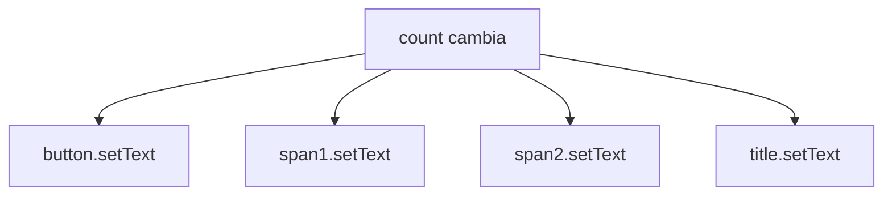

La explicación para los estudiantes puede ser:

> El problema no es que este código esté mal. Funciona. El problema es que cada vez que `count` cambia, nosotros tenemos que recordar todos los componentes que dependen de él.

Si mañana agregamos otro componente:

```java
Span status = new Span();
```

también tendremos que recordar actualizarlo:

```java
status.setText(...);
```

Ese es el problema que queremos resolver.

---

# 2. El mismo contador usando Signals

Ahora vamos a usar exactamente los mismos componentes, pero con un `ValueSignal`.

```java
@Route("signal-counter")
public class SignalCounterView extends VerticalLayout {

    private final ValueSignal<Integer> count =
            new ValueSignal<>(0);

    public SignalCounterView() {

        Button button = new Button();
        Span span1 = new Span();
        Span span2 = new Span();
        H2 title = new H2();

        button.addClickListener(event ->
                count.update(current -> current + 1)
        );

        button.bindText(
                count.map(value ->
                        "Clicked " + value + " times"
                )
        );

        span1.bindText(
                count.map(value ->
                        "Valor actual: " + value
                )
        );

        span2.bindText(
                count.map(value ->
                        "El doble es: " + (value * 2)
                )
        );

        title.bindText(
                count.map(value ->
                        "Contador en " + value
                )
        );

        add(title, button, span1, span2);
    }
}
```

La diferencia importante es esta:

```java
count.update(current -> current + 1);
```

Cuando hacemos clic, solamente cambiamos el estado.

Ya no tenemos que escribir:

```java
button.setText(...);
span1.setText(...);
span2.setText(...);
title.setText(...);
```

¿Por qué?

Porque cada componente ya declaró una vez cómo depende de `count`.

Por ejemplo:

```java
span1.bindText(
        count.map(value ->
                "Valor actual: " + value
        )
);
```

Esto significa:

> El texto de este `Span` depende del valor actual de `count`.

Cuando `count` cambia, Vaadin vuelve a evaluar el `map()` y actualiza el texto asociado automáticamente.

Por ejemplo, si:

```text
count = 0
```

el resultado es:

```text
Valor actual: 0
```

Si después:

```text
count = 5
```

Vaadin vuelve a evaluar:

```java
"Valor actual: " + 5
```

y el resultado pasa a ser:

```text
Valor actual: 5
```

Lo mismo ocurre con:

```java
count.map(value ->
        "El doble es: " + (value * 2)
)
```

Si:

```text
count = 5
```

entonces:

```text
El doble es: 10
```

## Flujo con Signals

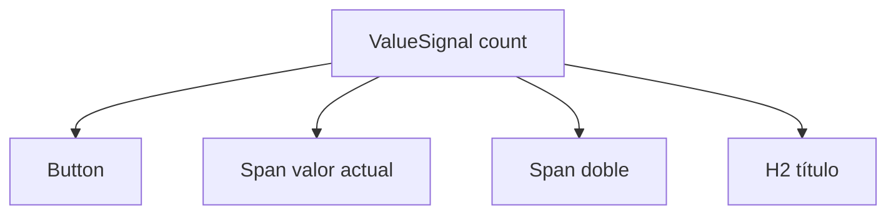

Ahora el flujo es:

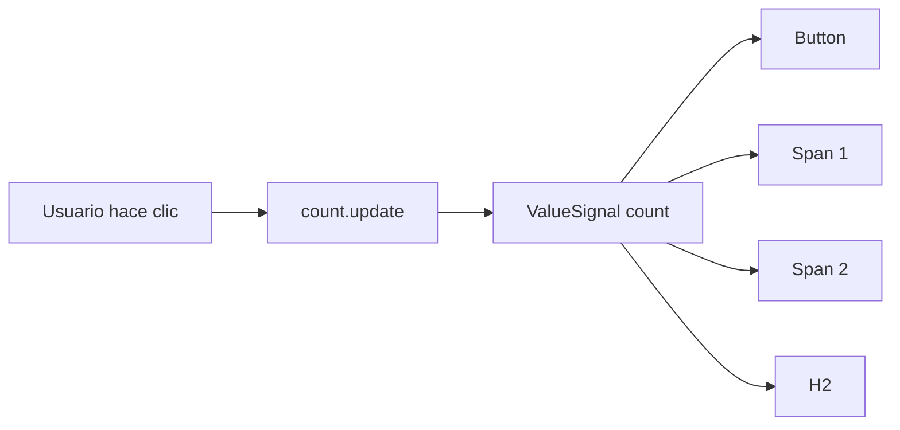

La explicación para los estudiantes puede ser:

> Antes, cuando cambiaba `count`, yo tenía que ir componente por componente actualizando la pantalla. Con Signals, cada componente declara una vez que depende de `count`. Después yo solamente cambio `count`.

Esta es la idea diferencial.

---

# 3. Comparación: tradicional vs Signals

## Tradicional

```java
count++;

button.setText(...);
span1.setText(...);
span2.setText(...);
title.setText(...);
```

Conceptualmente:

```text
count cambia
   ↓
yo actualizo Button
   ↓
yo actualizo Span
   ↓
yo actualizo otro Span
   ↓
yo actualizo H2
```

## Con Signals

```java
count.update(current -> current + 1);
```

Y previamente declaramos:

```java
button.bindText(...);
span1.bindText(...);
span2.bindText(...);
title.bindText(...);
```

Conceptualmente:

```text
count cambia
   ↓
Vaadin detecta las dependencias
   ↓
los componentes reaccionan
```

## Comparación visual

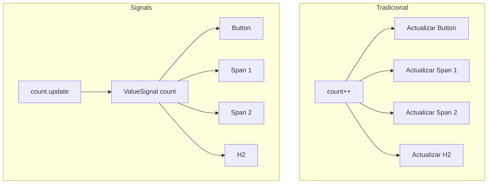

Una frase importante para la charla:

> Signals no son interesantes porque ahorren un `setText()`. Son interesantes porque permiten declarar una vez las dependencias y después modificar solamente el estado.

Otra frase útil:

> Con el enfoque tradicional, el desarrollador tiene que recordar quién depende del estado. Con Signals, esa relación queda declarada en el código.

---

# 4. ¿Qué es un ValueSignal?

Ahora llevemos la misma idea a un ejemplo más real.

Tenemos un buscador de productos:

```java
private final ValueSignal<String> searchQuery =
        new ValueSignal<>("");
```

`searchQuery` representa:

```text
La búsqueda actual del usuario
```

Inicialmente:

```text
searchQuery = ""
```

Después el usuario escribe:

```text
mouse
```

Entonces:

```text
searchQuery = "mouse"
```

Podemos pensar un `ValueSignal` como una **caja que guarda un valor y además puede avisar cuando ese valor cambia**.

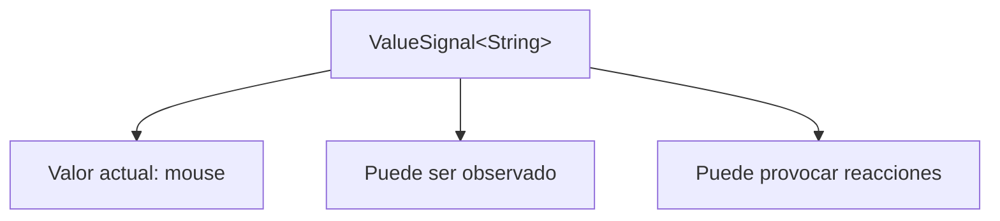

No es solamente una variable.

Es estado reactivo.

---

# 5. Nuestro ejemplo: búsqueda de productos

La vista puede verse así:

```java
@Route("")
public class ProductListView extends VerticalLayout {

    private final Grid<Product> grid = new Grid<>();
    private final List<Product> products = getSampleProducts();

    private final ValueSignal<String> searchQuery =
            new ValueSignal<>("");

    public ProductListView() {

        setSizeFull();
        configureGrid();

        TextField searchField = new TextField();

        searchField.setPlaceholder("Buscar");

        searchField.setValueChangeMode(
                ValueChangeMode.LAZY
        );

        searchField.bindValue(
                searchQuery,
                searchQuery::set
        );

        add(searchField);
        add(grid);

        Signal.effect(
                this,
                () -> updateProductList(
                        searchQuery.get()
                )
        );
    }
}
```

El flujo completo será:

```text
Usuario escribe
        ↓
TextField
        ↓
searchQuery
        ↓
Signal.effect
        ↓
updateProductList
        ↓
Grid
```

---

# 6. ValueChangeMode.LAZY

Esta línea:

```java
searchField.setValueChangeMode(
        ValueChangeMode.LAZY
);
```

controla cuándo queremos reaccionar al texto que escribe el usuario.

Supongamos que quiere buscar:

```text
mouse
```

El usuario escribe:

```text
m
mo
mou
mous
mouse
```

No siempre necesitamos ejecutar la búsqueda inmediatamente después de cada tecla.

Con `LAZY`, Vaadin espera una pequeña pausa antes de considerar el valor.

## Ejemplo conceptual

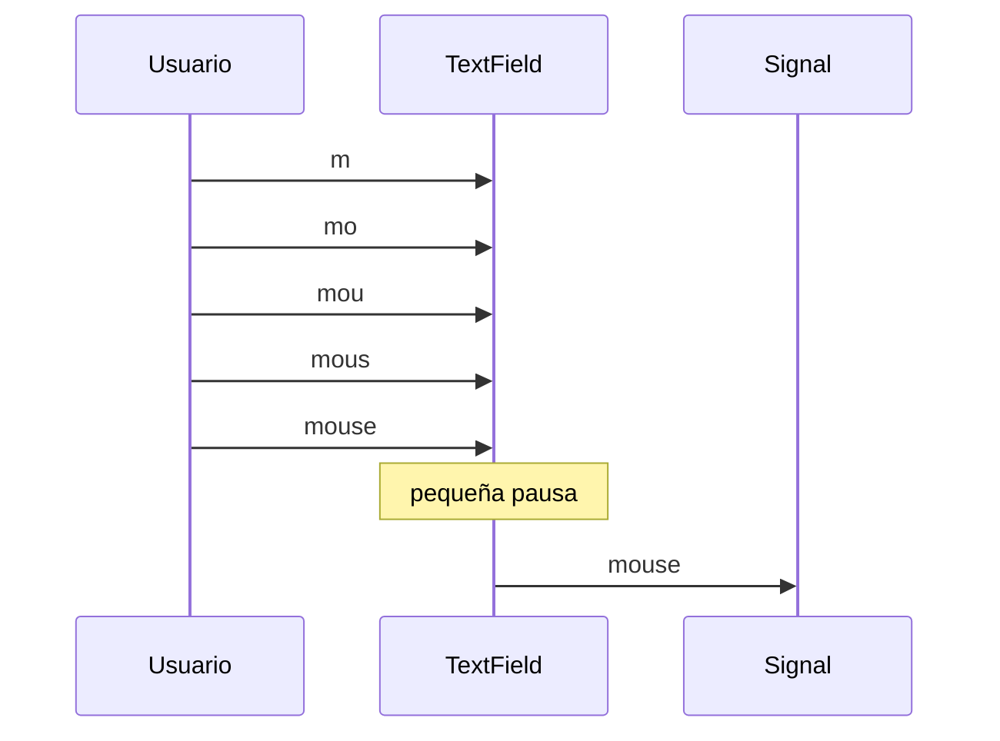

Una comparación del mundo real sería una persona preguntando algo en una tienda.

El cliente empieza diciendo:

```text
Quiero buscar una lap...
```

El empleado no sale inmediatamente.

Espera a que termine:

```text
Quiero buscar una laptop Lenovo
```

La idea de `LAZY` es parecida: evitar reaccionar demasiado pronto mientras el usuario todavía está escribiendo.

---

# 7. bindValue: conectar el TextField con el estado

Ahora tenemos:

```java
searchField.bindValue(
        searchQuery,
        searchQuery::set
);
```

Esta línea conecta el valor del `TextField` con nuestro Signal.

Conceptualmente:

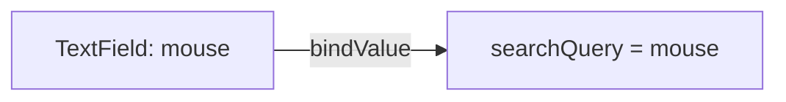

Cuando el usuario escribe:

```text
mouse
```

el Signal termina teniendo:

```text
searchQuery = "mouse"
```

Es parecido a escribir manualmente:

```java
searchField.addValueChangeListener(event -> {
    searchQuery.set(event.getValue());
});
```

Pero `bindValue` expresa directamente la relación entre el componente y el estado.

## La idea importante

El `TextField` no necesita saber que existe un `Grid`.

Solamente modifica:

```text
searchQuery
```

Eso desacopla los componentes.

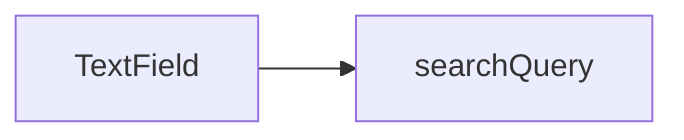

No tenemos:

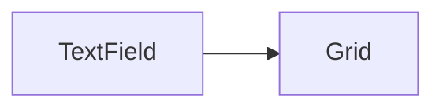

El `TextField` solamente conoce el estado.

---

# 8. Signal.effect

Ahora llegamos a una de las líneas más importantes:

```java
Signal.effect(
        this,
        () -> updateProductList(
                searchQuery.get()
        )
);
```

Podemos leerla así:

> Ejecuta esta lógica y observa los Signals que se consultan dentro de ella.

Dentro estamos haciendo:

```java
searchQuery.get()
```

Por lo tanto, el efecto depende de `searchQuery`.

Cuando `searchQuery` cambia, el efecto vuelve a ejecutarse.

Por ejemplo:

```text
searchQuery = ""
```

se ejecuta:

```java
updateProductList("");
```

Después el usuario escribe:

```text
mouse
```

Entonces:

```text
searchQuery = "mouse"
```

y el efecto vuelve a ejecutar:

```java
updateProductList("mouse");
```

---

# 9. Flujo de Signal.effect

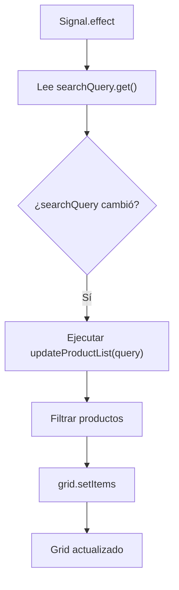

Podemos simplificarlo todavía más:

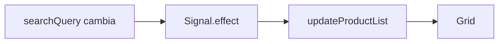

---

# 10. El método updateProductList

Nuestro método puede ser:

```java
private void updateProductList(String query) {

    List<Product> filtered =
            new ArrayList<>(products);

    if (query != null && !query.isBlank()) {

        String lowerQuery =
                query.toLowerCase();

        filtered = products.stream()

                .filter(product ->
                        product.getSku()
                                .toLowerCase()
                                .contains(lowerQuery)

                        || product.getName()
                                .toLowerCase()
                                .contains(lowerQuery)

                        || product.getCategory()
                                .name()
                                .toLowerCase()
                                .contains(lowerQuery)

                        || (
                                product.getSupplier() != null

                                && product.getSupplier()
                                        .toLowerCase()
                                        .contains(lowerQuery)
                        )
                )

                .collect(
                        Collectors.toCollection(
                                ArrayList::new
                        )
                );
    }

    grid.setItems(filtered);
}
```

Este método no necesita saber nada sobre Signals.

Simplemente recibe:

```java
String query
```

filtra los productos y actualiza:

```java
grid.setItems(filtered);
```

Esto es importante porque Signals no obligan a poner toda nuestra lógica dentro del Signal.

El Signal simplemente decide **cuándo ejecutar la lógica**.

---

# 11. Flujo completo de búsqueda

Ahora podemos unir todo.

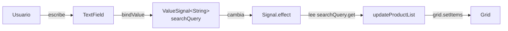

Ejemplo real:

```text
Usuario escribe: monitor
```

Entonces:

```text
TextField = "monitor"
        ↓
searchQuery = "monitor"
        ↓
Signal.effect se ejecuta
        ↓
updateProductList("monitor")
        ↓
se filtran los productos
        ↓
grid.setItems(...)
        ↓
el usuario ve solo los productos que coinciden
```

---

# 12. La idea más importante: desacoplamiento

Uno de los conceptos importantes de este ejemplo es que:

> El TextField no sabe que existe el Grid.

El campo solamente modifica:

```java
searchQuery
```

Y otra parte de la aplicación reacciona.

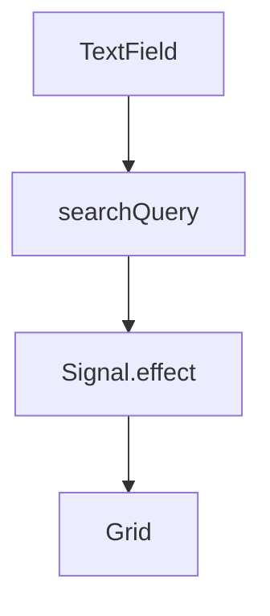

Esto hace que los componentes tengan menos conocimiento entre ellos.

---

# 13. ¿Por qué esto puede escalar mejor?

Hoy solamente tenemos:

```text
searchQuery
        ↓
Grid
```

Pero mañana podríamos necesitar:

```text
searchQuery
        ↓
Grid filtrado

searchQuery
        ↓
Cantidad de resultados

searchQuery
        ↓
Mensaje de "sin resultados"

searchQuery
        ↓
Botón limpiar

searchQuery
        ↓
Título de búsqueda
```

Con Signals podemos pensar en un solo estado:

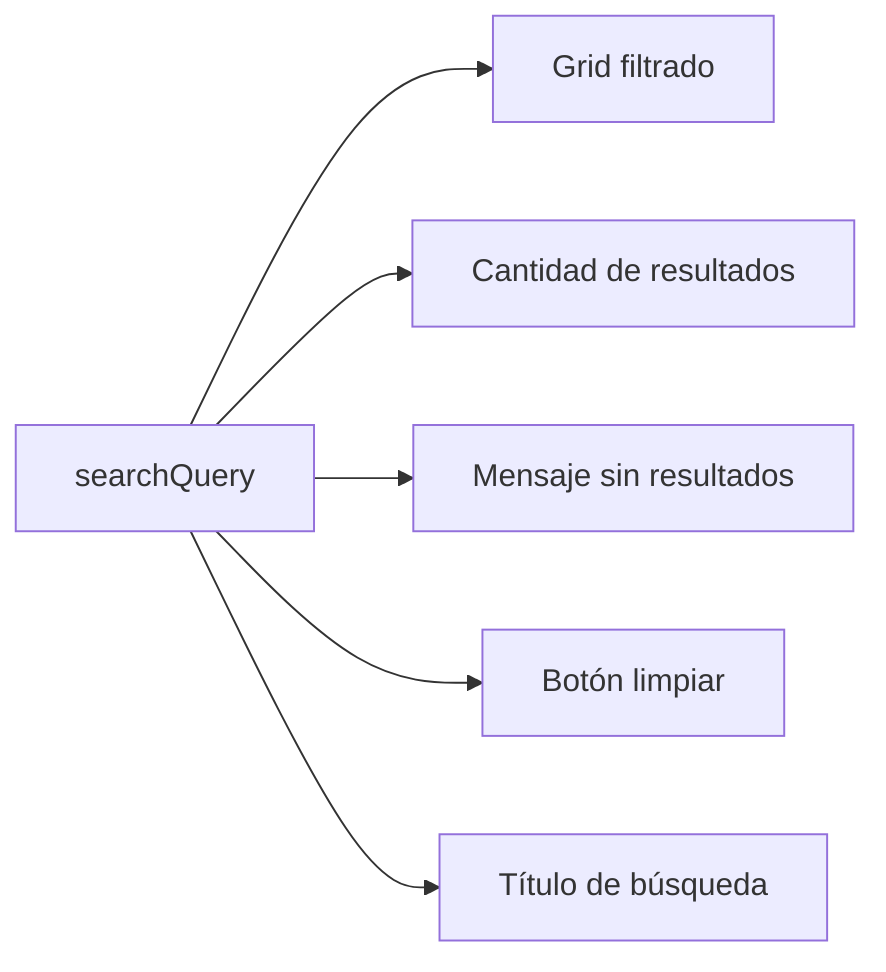

Todos pueden depender del mismo estado.

El campo de búsqueda no necesita conocer ninguno de ellos.

---

# 14. Comparación con el enfoque tradicional

Una implementación tradicional podría ser:

```java
searchField.addValueChangeListener(event -> {

    String query =
            event.getValue();

    updateProductList(query);
});
```

Esto funciona.

Conceptualmente tenemos:

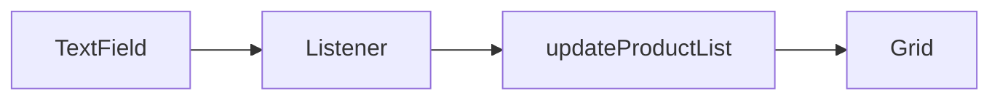

Aquí el evento del `TextField` sabe directamente qué lógica debe ejecutar.

Con Signals tenemos:

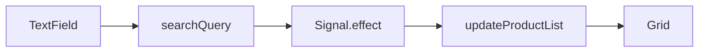

Ahora existe un estado intermedio:

```text
searchQuery
```

Ese estado puede ser usado por diferentes partes de la interfaz.

---

# 15. Comparación final

## Sin Signals

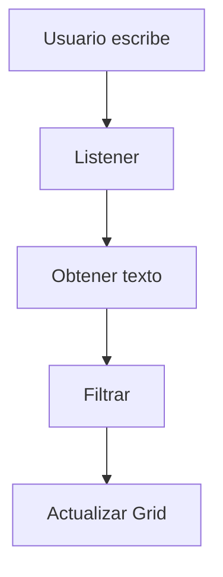

El evento controla directamente qué ocurre.

## Con Signals

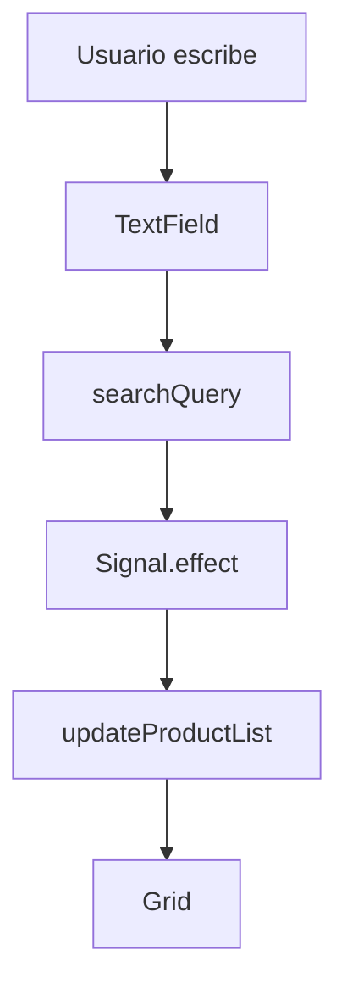

El flujo pasa primero por el estado.

---

# 16. Los tres conceptos que debemos recordar

## ValueSignal

```java
private final ValueSignal<String> searchQuery =
        new ValueSignal<>("");
```

Representa:

```text
Dónde vive el estado
```

---

## bindValue

```java
searchField.bindValue(
        searchQuery,
        searchQuery::set
);
```

Representa:

```text
Cómo un componente modifica ese estado
```

---

## Signal.effect

```java
Signal.effect(
        this,
        () -> updateProductList(
                searchQuery.get()
        )
);
```

Representa:

```text
Qué lógica debe reaccionar cuando cambia el estado
```

---

# 17. Resumen mental

Podemos recordar Signals con este esquema:

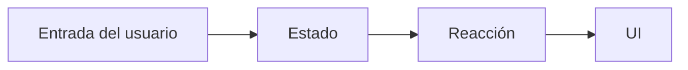

En nuestro ejemplo:

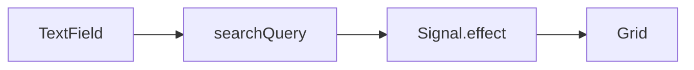

---

# 18. Frase para explicar Signals

Una forma sencilla de explicarlo durante la charla es:

> En el enfoque tradicional, cuando cambia un dato, normalmente nosotros mismos debemos recordar qué componentes actualizar.  
> Con Signals declaramos las dependencias entre el estado y la interfaz. Después modificamos el estado y las partes que dependen de él pueden reaccionar automáticamente.

Otra frase útil:

> El TextField no necesita saber que existe un Grid. Solo actualiza el estado `searchQuery`. El resto de la aplicación reacciona a ese estado.

---

# 19. Secuencia recomendada para una presentación

Una forma pedagógica de explicar todo esto es:

```text
1. Mostrar contador tradicional

2. Preguntar:
   ¿Qué pasa si cinco componentes dependen del mismo count?

3. Mostrar contador con Signal

4. Explicar:
   ValueSignal = estado reactivo

5. Mostrar:
   bindText

6. Pasar al ejemplo real del buscador

7. Explicar:
   searchQuery

8. Explicar:
   ValueChangeMode.LAZY

9. Explicar:
   bindValue

10. Explicar:
    Signal.effect

11. Mostrar el flujo completo

12. Mostrar cómo varios componentes pueden depender
    del mismo Signal
```

El objetivo no es presentar Signals como "menos líneas de código".

La idea más importante es:

```text
Separar el estado de los componentes que reaccionan a él.
```

---

# 20. Código completo del ejemplo

```java
@Route("")
public class ProductListView extends VerticalLayout {

    private final Grid<Product> grid =
            new Grid<>();

    private final List<Product> products =
            getSampleProducts();

    private final ValueSignal<String> searchQuery =
            new ValueSignal<>("");

    public ProductListView() {

        setSizeFull();

        configureGrid();

        TextField searchField =
                new TextField();

        searchField.setPlaceholder(
                "Buscar"
        );

        searchField.setValueChangeMode(
                ValueChangeMode.LAZY
        );

        searchField.bindValue(
                searchQuery,
                searchQuery::set
        );

        add(searchField);

        add(grid);

        Signal.effect(
                this,
                () -> updateProductList(
                        searchQuery.get()
                )
        );
    }

    private void updateProductList(
            String query
    ) {

        List<Product> filtered =
                new ArrayList<>(products);

        if (
                query != null
                && !query.isBlank()
        ) {

            String lowerQuery =
                    query.toLowerCase();

            filtered = products.stream()

                    .filter(product ->

                            product.getSku()
                                    .toLowerCase()
                                    .contains(lowerQuery)

                            || product.getName()
                                    .toLowerCase()
                                    .contains(lowerQuery)

                            || product.getCategory()
                                    .name()
                                    .toLowerCase()
                                    .contains(lowerQuery)

                            || (
                                    product.getSupplier() != null

                                    && product.getSupplier()
                                            .toLowerCase()
                                            .contains(lowerQuery)
                            )
                    )

                    .collect(
                            Collectors.toCollection(
                                    ArrayList::new
                            )
                    );
        }

        grid.setItems(filtered);
    }
}
```

---

# Conclusión

Signals permiten pensar la interfaz de una forma diferente.

En lugar de pensar:

```text
Cuando ocurra este evento,
busca todos los componentes
que debo actualizar.
```

podemos pensar:

```text
Este es mi estado.

Estos componentes o efectos
dependen de ese estado.

Cuando el estado cambie,
ellos reaccionarán.
```

Ese cambio de mentalidad es probablemente lo más importante para entender Signals.
