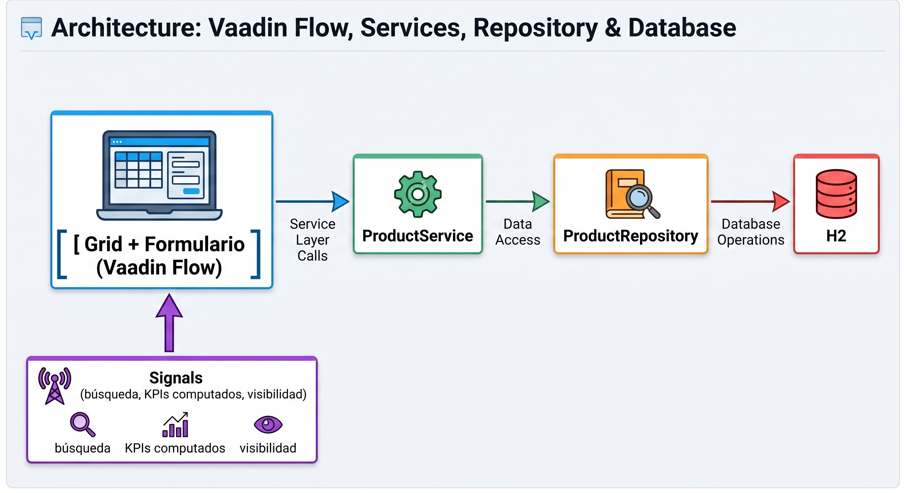

# StockPilot: inventario en Java puro con Vaadin Flow

Esta guía se puede seguir sola, de principio a fin. Construimos desde cero
**StockPilot**, un catálogo de inventario con Grid, búsqueda reactiva, KPIs
en vivo, formularios validados, base de datos real y navegación, todo en
Java, sin escribir HTML, sin un build de JavaScript, y sin separar el
proyecto en un backend y un frontend.

!!! note "Vaadin no es solo para prototipos"
    Mucha gente cree que Vaadin sirve para maquetas rápidas y que "la UI de
    verdad" hay que hacerla en React o Angular. Vaadin Flow corre en
    producción en bancos, aseguradoras y sistemas de salud en toda Europa
    hace más de una década. No es un atajo, es una arquitectura distinta.
    En esta guía vas a ver por qué es una opción seria para un equipo de
    backend.

## El problema que motiva todo esto

La última herramienta interna que tu equipo construyó (un panel de
inventario, un backoffice de pedidos) probablemente terminó siendo dos
repos: un backend en Spring Boot con una API REST, y un frontend en React o
Angular consumiéndola. Dos lenguajes, un contrato que mantener sincronizado
a mano, validación duplicada en los dos lados, y un pipeline de build de
JavaScript, todo para mostrar una tabla y un formulario que ningún usuario
externo a la empresa va a ver jamás. La Sesión 0 desarrolla este problema
con calma y explica por qué Vaadin es la respuesta.

## Qué vamos a construir

**StockPilot**, un catálogo de productos e inventario:

- Un Grid con búsqueda reactiva sobre SKU, nombre, categoría y proveedor.
- KPIs en vivo (valor total del inventario, productos con stock bajo)
  que se recalculan solos usando **Signals**, el sistema de estado
  reactivo de Vaadin.
- Un formulario de alta, edición y baja, con validación y modo buffered
  (guardar/descartar).
- Persistencia real con Spring Data JPA sobre una base H2.
- Navegación entre dos pantallas con un App Shell.
- Un tema propio, con colores y estilos de marca.

Y organizado con **package-by-feature**: todo lo de "producto" (entidad,
repositorio, servicio y vista) vive en un solo paquete, en vez de
repartido entre una capa `backend` y una capa `ui`. La Sesión 1 explica por
qué esta decisión importa tanto como la elección de framework.

## Cómo está organizada

Cada sesión es una etapa y, si quieres, una rama de tu propio repo:

| Sesión | Rama sugerida | Qué construye |
|--------|---------------|----------------|
| 0 | (sin rama) | El problema, por qué Vaadin, y el setup del entorno |
| 1 | `sesion-1` | El proyecto generado, package-by-feature, y tus primeros componentes |
| 2 | `sesion-2` | El Grid con datos de prueba y búsqueda reactiva con Signals |
| 3 | `sesion-3` | El momento clave: KPIs de negocio con Signals computados |
| 4 | `sesion-4` | El formulario de detalle, enlazado con Binder y validado |
| 5 | `sesion-5` | Guardar, descartar, alta de productos y baja con confirmación |
| 6 | `sesion-6` | Backend real con Spring Data JPA |
| 7 | `sesion-7` | Navegación con App Shell y una segunda feature |
| 8 | `sesion-8` = `main` | Theming, CSS y marca propia |

!!! tip "Para seguir a tu ritmo"
    No hace falta hacer las nueve sesiones de una sentada. Cada una termina
    en un estado que compila y corre. Si armas una rama por sesión (`git
    branch sesion-N` al cerrar cada una, como se indica al final de cada
    página), puedes volver atrás en cualquier momento sin perder nada.

## Versiones

Java 25 · Spring Boot 4.1.0 · Vaadin Flow 25.2.6 · Maven · H2 (en memoria).

!!! note "Confirma versiones en el asistente"
    En [start.vaadin.com](https://start.vaadin.com) y
    [start.spring.io](https://start.spring.io) las versiones disponibles
    cambian con el tiempo. Si no ves exactamente estas versiones, elige la
    más reciente estable dentro de la misma serie (Vaadin 25.x, Spring Boot
    4.1.x): el asistente se encarga de que las dependencias sean
    compatibles entre sí.

Cuando estés listo, arranca por la [Sesión 0](sesion_0.md).
