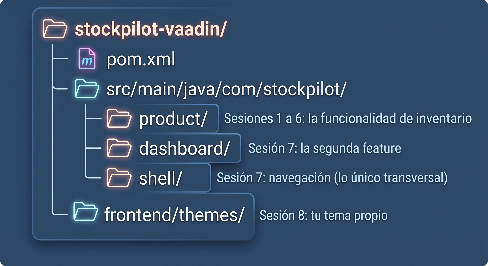

# Sesión 0: El problema, por qué Vaadin y el setup

**Lo que vas a lograr**: entender a fondo el problema que resuelve Vaadin,
por qué lo elegimos en vez de separar frontend y backend, y dejar tu
entorno listo para la Sesión 1.

---

## Parte 1: El problema, en una historia
Un equipo de backend necesita un panel interno de inventario. Nada
glamoroso: una tabla de productos, un formulario para editarlos, un botón
para eliminar. Como todo el mundo hoy separa frontend de backend, arrancan
así: un servicio Spring Boot con un `ProductController` que expone
`/api/products`, y un proyecto React aparte que lo consume.

Tres semanas después, el inventario "simple" tiene:

1. **Un DTO por cada lado.** El `Product` de Java, un `Product` en
   TypeScript, y un mapper (a veces manual, a veces generado) para que no
   se desincronicen. Cada campo nuevo se agrega dos veces.
2. **Validación por partida doble.** "El precio debe ser mayor a cero" vive
   en el backend, con Bean Validation, porque no se puede confiar en el
   cliente. Y vive otra vez en el frontend, con una librería de formularios
   de React, porque nadie quiere esperar un roundtrip HTTP para enterarse
   de un error de tipeo.
3. **Una superficie de ataque más ancha.** Ahora hay CORS que configurar,
   un token que viajar entre dos servicios, y una API pública (aunque sea
   "interna") que alguien tiene que versionar y documentar.
4. **Un segundo pipeline de build**, con su `node_modules`, su bundler, sus
   actualizaciones de dependencias, para una pantalla que en el fondo es
   una tabla y un formulario.

Nada de esto es difícil por separado. El problema es que **se paga todo
junto, siempre**, para cualquier herramienta interna, sin importar cuán
simple sea. Y en un equipo de backend sin ingenieros de frontend dedicados,
ese costo compite directamente con el tiempo que podrían invertir en el
negocio.

---

## Parte 2: Por qué Vaadin y no otra opción
Antes de elegir, miremos las alternativas reales para este problema:

- **Frontend separado (React/Angular/Vue) + API REST**: la opción por
  defecto de la industria. Excelente cuando de verdad hay múltiples
  clientes (web, móvil) consumiendo la misma API, o cuando hay un equipo de
  frontend dedicado. Para una herramienta interna de un solo equipo, es
  pagar la complejidad de una arquitectura multi-cliente sin tener
  múltiples clientes.
- **Server-side rendering con plantillas (Thymeleaf, JSP)**: evita el
  segundo lenguaje, pero te devuelve a escribir HTML a mano, y cualquier
  interacción rica (una tabla que se filtra sin recargar la página, un
  formulario que valida mientras escribes) requiere JavaScript de todos
  modos, aunque sea poco.
- **Vaadin Flow**: los componentes de UI son objetos Java. Vaadin mantiene
  una conexión persistente con el navegador y traduce cada cambio de
  estado del servidor en actualizaciones del DOM. Nunca escribes HTML, CSS
  obligatorio, ni JavaScript, y sin embargo tienes interacciones ricas
  (Grid ordenable, formularios reactivos) de fábrica.

Elegimos Vaadin por tres razones concretas:

1. **Un solo lenguaje, un solo repo.** El equipo que ya sabe Java escribe
   la UI en Java. No hay que aprender React ni TypeScript para construir
   una herramienta interna.
2. **Cero contrato que mantener sincronizado.** No hay DTOs duplicados ni
   generador de clientes: la vista y el servicio comparten literalmente las
   mismas clases de dominio.
3. **La validación se escribe una sola vez**, del lado del servidor, con
   Binder, y aun así se siente instantánea para el usuario, porque el
   servidor está a milisegundos, no a un despliegue de distancia.

|  | Frontend separado + REST | Vaadin Flow |
|--|---------------------------|--------------|
| Lenguajes en el equipo | Dos | Uno |
| Dónde vive el estado de la UI | En el navegador | En el servidor |
| Contrato entre capas | API REST + DTOs a sincronizar | No existe: mismas clases |
| Validación | Duplicada (cliente y servidor) | Una sola vez (Binder) |
| Build de JavaScript | Sí | No |
| SEO / tráfico público masivo | Es su fuerte | No es su caso de uso |

!!! warning "Vaadin no es la respuesta para todo"
    Si estás construyendo algo público que necesita SEO, contenido cacheado
    en un CDN para millones de visitas, o ya tienes un equipo de frontend
    sirviendo varios clientes (web, iOS, Android) contra la misma API, la
    separación frontend/backend sigue siendo la decisión correcta. Vaadin
    brilla en el otro extremo: herramientas internas, backoffices,
    dashboards: el tipo de software que un equipo de backend construye
    todo el tiempo, y donde separar en dos repos es pagar una complejidad
    que nadie afuera de la empresa va a agradecer. StockPilot, lo que vamos
    a construir, es exactamente ese caso.

---

## Parte 3: Los conceptos en dos minutos

Dos ideas van a aparecer una y otra vez en esta guía:

- **Signals**: el sistema de estado reactivo de Vaadin. En vez de escuchar
  eventos y actualizar la UI a mano, declaras la relación entre un dato y
  la UI una sola vez, y el framework mantiene todo sincronizado. Lo vas a
  ver de cerca en la Sesión 2, y en su forma más potente (como KPIs de
  negocio derivados) en la Sesión 3.
- **Package-by-feature**: la forma en que vamos a organizar el código. En
  vez de separar por capa técnica (`backend`, `ui`), separamos por
  funcionalidad de negocio (`product`, `dashboard`). La Sesión 1 dedica su
  primera parte entera a explicar por qué.

!!! abstract "Qué es Vaadin Flow, en una frase"
    Un framework de Java (o Kotlin) donde cada componente de UI (botón,
    campo de texto, tabla) es un objeto del lado del servidor, y el
    framework se encarga de pintar y actualizar el navegador sin que
    escribas una línea de HTML o JavaScript.

---

## Parte 4: Lo que necesitas instalar
### Java 25

```bash
java -version
```

=== "macOS / Linux"

    ```bash
    sdk install java 25-tem   # con SDKMAN
    ```

=== "Windows"

    ```powershell
    winget install EclipseAdoptium.Temurin.25.JDK
    ```

!!! note "¿No tienes Java 25 todavía?"
    Vaadin 25 funciona con Java 21 en adelante. Si tu organización todavía
    no migró a 25, puedes seguir toda esta guía con Java 21 sin cambiar nada
    del código: solo ajusta `java.version` en el `pom.xml` cuando lo
    generemos en la Sesión 1.

### Maven

La mayoría de los IDEs lo traen integrado. Para verificar que tienes uno
disponible desde la terminal:

```bash
mvn -version
```

### IntelliJ IDEA (o tu IDE preferido)

La Community Edition alcanza: [jetbrains.com/idea](https://www.jetbrains.com/idea/download/).

!!! tip "El plugin de Vaadin, para hot reload"
    Instala el plugin oficial de Vaadin desde el marketplace de tu IDE.
    Te permite correr la app en modo "debug con hot swap agent": cada vez
    que guardas un cambio en Java, se refleja en el navegador sin
    reiniciar el servidor. No es obligatorio para seguir la guía, pero
    acorta muchísimo el ciclo de prueba-y-error de cada sesión.

### Visual Studio Code (si vas a usarlo en vez de un IDE de JetBrains)

Si tu equipo usa VS Code, instala estos dos packs de extensiones desde el
Marketplace antes de la Sesión 1:

- **Extension Pack for Java** (Microsoft): soporte del lenguaje, debugger
  y ejecución de proyectos Maven/Gradle.
- **Spring Boot Extension Pack** (VMware): autocompletado de
  `application.properties`, navegación de beans y ejecución de
  aplicaciones Spring Boot.

!!! tip "Los dos packs son necesarios, no alcanza con uno solo"
    El pack de Java te da el soporte base del lenguaje; el de Spring Boot
    añade todo lo específico del framework (beans, endpoints,
    propiedades). Sin el segundo, VS Code no te resalta ni autocompleta
    nada de Spring.

### Un navegador moderno

Cualquiera sirve. Vaadin no requiere ninguna extensión ni configuración
especial del lado del cliente.

---

## Parte 5: La carpeta del repo

```bash
mkdir stockpilot-vaadin
cd stockpilot-vaadin
git init
```

Al final de esta guía vas a tener un único proyecto Maven, generado en la
Sesión 1, con esta forma:



!!! tip "Dónde van tus capturas"
    Si vas a documentar tu propio avance con imágenes, te sugiero una
    carpeta `docs/images/` dentro del repo, con un nombre por sesión:
    `sesion1-grid-vacio.png`, `sesion3-kpis-en-vivo.png`, y así. Esta guía
    deja el lugar marcado en cada sesión con `![...]" para que sepas
    exactamente dónde va cada una.

Cuando estés listo, sigue a la [Sesión 1](sesion_1.md).
