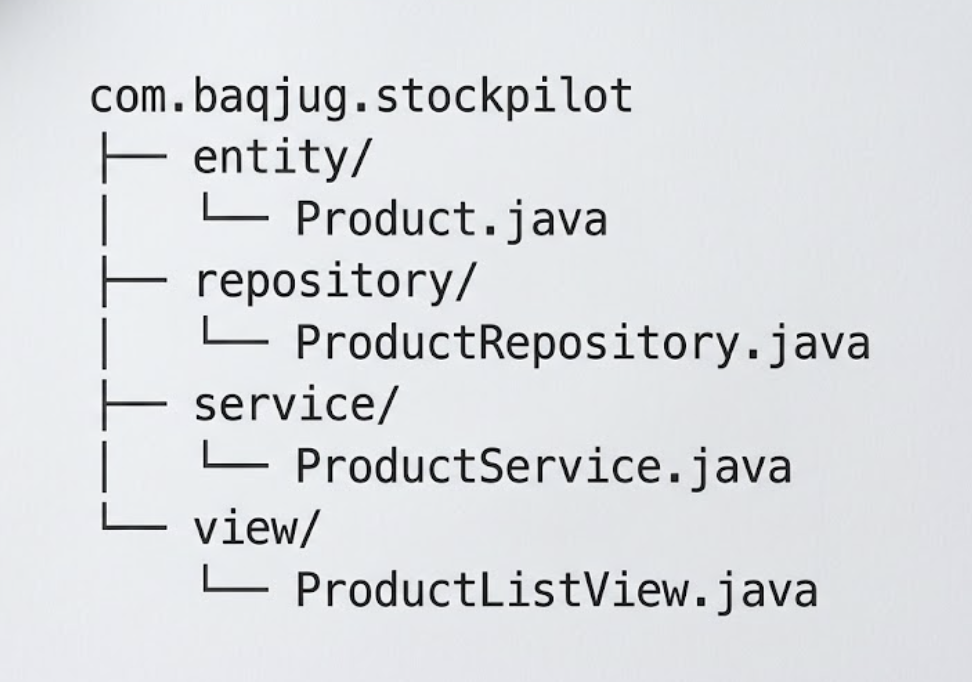
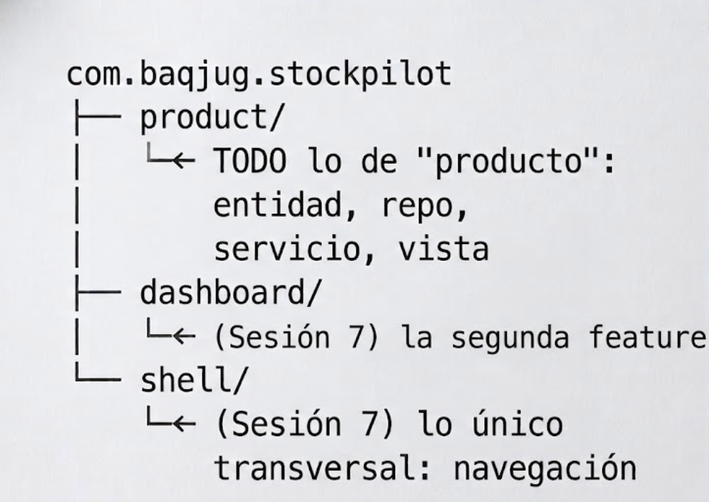
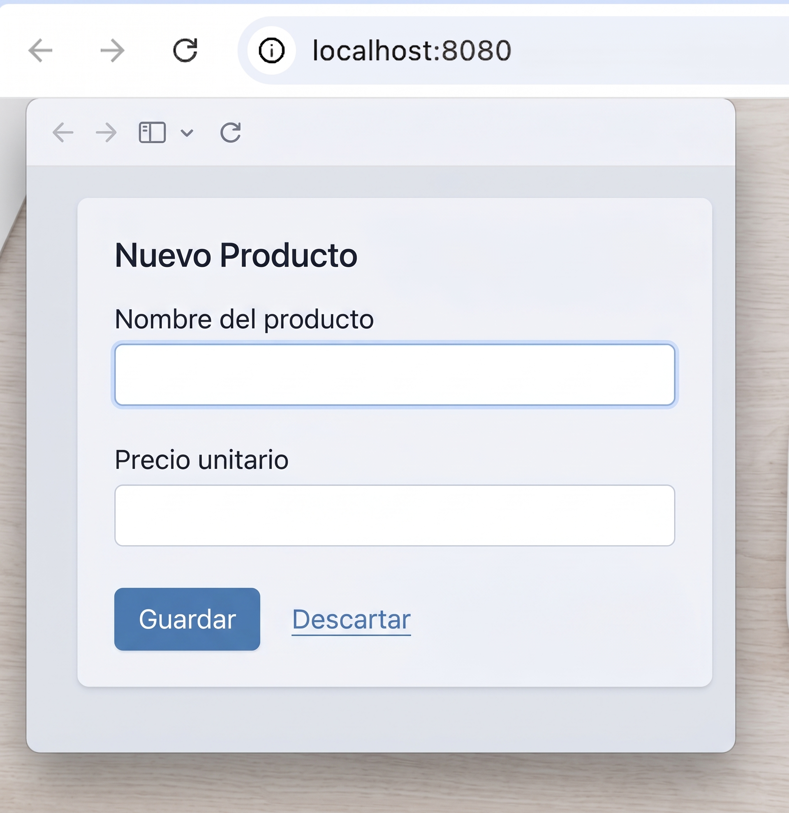

# Sesión 1: El proyecto y package-by-feature

**Rama**: `sesion-1`
**Lo que vas a lograr**: el proyecto `stockpilot` generado y corriendo,
organizado con package-by-feature desde el primer archivo, y tus primeros
componentes de Vaadin en pantalla.

---

## Parte 1: Generar el proyecto con start.vaadin.com

A diferencia de un proyecto Spring Boot cualquiera, para Vaadin conviene
arrancar desde el asistente propio del framework:
[https://start.vaadin.com](https://start.vaadin.com). Ya viene con el BOM
de Vaadin, el plugin de Maven y una vista de ejemplo configurados: te
ahorra la parte más propensa a errores de versión.

Completa:

| Campo | Valor |
|-------|-------|
| Framework | **Flow** (no Hilla, que es para UIs en React con endpoints TypeScript; nosotros queremos Java puro de punta a punta) |
| Application name | `stockpilot` |
| Technology stack | **Spring Boot** |
| Language | **Java** |
| Build tool | **Maven** |
| Group ID | `com.baqjug.stockpilot` |
| Version de Vaadin | **25.2.6** (o la 25.x estable más reciente) |
| Java version | **25** |

Elige la plantilla **"Empty"** (o "Plain Java") en vez de alguna de las
plantillas con ejemplos de negocio: vamos a construir todo nosotros, capa
por capa, y no queremos código de muestra estorbando.

Descarga el `.zip`, descomprímelo dentro de tu carpeta de repo, y ábrelo en
tu IDE:

```bash
unzip ~/Downloads/stockpilot.zip -d .
```

La primera vez que abres el proyecto, Maven descarga las dependencias y
Vaadin prepara su frontend interno (aunque nunca vayas a tocarlo a mano).
Espera a que termine antes de seguir.

!!! note "¿Por qué no Spring Initializr?"
    Podrías arrancar en [start.spring.io](https://start.spring.io) y
    agregar Vaadin como dependencia a mano (así se hace cuando Vaadin se
    suma a un proyecto Spring que ya existe). Para un proyecto que nace
    siendo una app Vaadin, start.vaadin.com te ahorra fijar a mano la
    versión del BOM y del plugin de Maven, que tienen que coincidir entre
    sí.

---

## Parte 2: Por qué package-by-feature
Antes de escribir la primera vista, tomemos una decisión de arquitectura
que va a acompañar todo el proyecto: cómo organizamos los paquetes.

Si abres el proyecto que acabas de generar, vas a ver que viene casi
vacío: un único paquete `com.baqjug.stockpilot`, con la clase
`Application.java` adentro y nada más. La plantilla no te impone ninguna
arquitectura interna: esa decisión queda en tus manos, y la vamos a tomar
ahora, antes de escribir la primera línea de código de negocio.

La opción más común en un proyecto Spring Boot es separar **por capa
técnica**: un paquete para toda la lógica de negocio (entidades,
servicios, repositorios) y otro para las vistas o controladores. Para
StockPilot, con un único dominio ("producto"), se vería así:



Es la estructura que vas a encontrar en la gran mayoría de proyectos
Spring Boot del mundo real, y funciona perfecto mientras el proyecto tiene
una sola funcionalidad de negocio.

El problema aparece cuando el proyecto crece. El día que StockPilot necesite
una segunda funcionalidad real (pedidos, proveedores, reportes), cada
paquete técnico se va a llenar de clases de dominios distintos mezcladas
entre sí. Para tocar "todo lo de producto" vas a tener que saltar entre
cuatro paquetes lejanos (`entity`, `repository`, `service`, `view`), y el
compilador no te va a avisar si una vista de "pedidos" termina usando por
accidente una entidad de "producto" que no debería tocar.

Vamos a organizar distinto: **package-by-feature**. Todo lo que tiene que
ver con la funcionalidad "producto" (la entidad, el repositorio, el
servicio, la vista) vive en un solo paquete, `product`, dentro de tu
proyecto real. El día de mañana, "pedidos" sería una carpeta nueva,
`order`, sin tocar una sola línea de `product`.



Elegimos package-by-feature por tres razones:

1. **La cercanía sigue a la relación real entre las clases.** Un
   `ProductService` cambia junto con `Product` y `ProductRepository` mucho
   más seguido de lo que cambia junto con un `OrderService` que no tiene
   nada que ver. El paquete debería reflejar eso.
2. **Agregar una funcionalidad no toca las que ya existen.** Una carpeta
   nueva, sin tocar nada de las demás: lo vas a comprobar con tus propias
   manos en la Sesión 7, cuando agreguemos `dashboard/` sin modificar ni
   una línea de `product/`.
3. **El límite entre funcionalidades queda explícito.** Package-by-layer no
   te impide que una vista de pedidos importe una entidad de producto sin
   pasar por su servicio. Package-by-feature no lo prohíbe por sí solo
   tampoco (Java no tiene "paquetes con permisos" de fábrica), pero hace
   mucho más incómodo el atajo, porque cruzar de un paquete de feature a
   otro se nota al mirar los imports.

!!! danger "La única excepción: lo transversal"
    No todo es una feature de negocio. La navegación general de la app, por
    ejemplo, no es "de producto" ni "de pedidos": es de toda la
    aplicación. Para eso reservamos un paquete técnico explícito, `shell/`
    (lo vas a crear en la Sesión 7). La regla no es "cero paquetes
    técnicos": es "el dominio manda, lo técnico es la excepción declarada".

---

## Parte 3: Creando la estructura de paquetes
Dentro de `src/main/java/com/baqjug/stockpilot`, crea el paquete `product`
(clic derecho → **New → Package** en IntelliJ, o `mkdir -p` desde la
terminal):

```bash
mkdir -p src/main/java/com/baqjug/stockpilot/product
```

---

## Parte 4: Tus primeros componentes
En Vaadin, cada componente de UI es una clase de Java: si necesitas un
botón, instancias un botón; si necesitas un campo de texto, instancias un
campo de texto. No hay una plantilla HTML detrás: el árbol de componentes
del lado del servidor **es** la interfaz.

Primero, el modelo. Todavía sin ninguna anotación de persistencia (eso
llega en la Sesión 6), porque queremos construir toda la experiencia de
usuario con datos de prueba antes de depender de una base de datos.

`product/ProductCategory.java`:

```java
package com.baqjug.stockpilot.product;

public enum ProductCategory {
    ELECTRONICS,
    GROCERY,
    APPAREL,
    HOME_GOODS,
    TOYS,
    OTHER
}
```

`product/Product.java`: un bean simple, con getters y setters, y un id
`Long` que por ahora vamos a dejar en `null` para los productos que todavía
no existen en ninguna base (esa idea de "id nulo = producto nuevo" la vamos
a usar bastante a partir de la Sesión 5):

```java
package com.baqjug.stockpilot.product;

import java.math.BigDecimal;
import java.time.LocalDate;

public class Product {

    private Long id;
    private String sku;
    private String name;
    private ProductCategory category;
    private BigDecimal unitPrice;
    private int stockQuantity;
    private int reorderLevel;
    private String supplier;
    private boolean active = true;
    private LocalDate lastRestockedDate;

    public Product() {
    }

    // getters y setters de cada campo -- IntelliJ: Code → Generate → Getter and Setter

    public boolean isLowStock() {
        return stockQuantity < reorderLevel;
    }
}
```

!!! tip "Genera los getters/setters con el IDE"
    No los escribas a mano: en IntelliJ, `Alt+Insert` (o `Code → Generate`)
    → **Getter and Setter**, selecciona todos los campos. Vas a necesitar
    todos los getters y setters de estos campos más adelante, sobre todo
    cuando lleguemos al Binder en la Sesión 4.

Ahora sí, la vista. Vamos a empezar simple: un campo de texto para el
nombre, un campo numérico para el precio, y dos botones.

`product/ProductListView.java`:

```java
package com.baqjug.stockpilot.product;

import com.vaadin.flow.component.button.Button;
import com.vaadin.flow.component.notification.Notification;
import com.vaadin.flow.component.orderedlayout.HorizontalLayout;
import com.vaadin.flow.component.orderedlayout.VerticalLayout;
import com.vaadin.flow.component.textfield.NumberField;
import com.vaadin.flow.component.textfield.TextField;
import com.vaadin.flow.router.Route;

@Route("")
public class ProductListView extends VerticalLayout {

    public ProductListView() {
        TextField nameField = new TextField("Nombre del producto");
        add(nameField);

        NumberField priceField = new NumberField("Precio unitario");
        add(priceField);

        Button saveButton = new Button("Guardar");
        saveButton.addClickListener(event ->
                Notification.show("Producto guardado (todavía no de verdad)"));

        Button discardButton = new Button("Descartar");
        discardButton.addClickListener(event ->
                Notification.show("Cambios descartados"));

        HorizontalLayout buttons = new HorizontalLayout(saveButton, discardButton);
        add(buttons);
    }
}
```

!!! abstract "Vaadin al paso: `@Route`, layouts y `add(...)`"
    - `@Route("")` registra la clase como una vista, servida en la URL que
      indiques. Una cadena vacía significa la raíz del sitio
      (`localhost:8080/`).
    - `VerticalLayout` es un contenedor que apila sus componentes uno
      debajo del otro. `HorizontalLayout` hace lo mismo pero lado a lado.
      Los layouts se anidan entre sí, y así se construyen interfaces
      complejas: layouts dentro de layouts.
    - `add(...)` agrega un componente al layout. Puedes pasarle uno o
      varios de una vez, como en `new HorizontalLayout(saveButton,
      discardButton)`.
    - `addClickListener` registra código que corre en el servidor cuando el
      usuario hace clic. No hay JavaScript de por medio: el clic viaja al
      servidor, tu lambda corre ahí, y si el estado de algún componente
      cambió, Vaadin actualiza el navegador solo.
    - `Notification.show(...)` es la forma más simple de darle feedback al
      usuario: un mensaje flotante que desaparece solo.

Corre la aplicación:

```bash
mvn spring-boot:run
```

Abre `http://localhost:8080` y prueba los dos botones: deberías ver la
notificación de cada uno.



---

## Cierre de la sesión

```bash
git add .
git commit -m "sesion-1: proyecto generado, package-by-feature y primeros componentes"
git branch sesion-1
```

En la [Sesión 2](sesion_2.md) reemplazamos estos campos sueltos por un
Grid de verdad, y agregamos búsqueda reactiva con Signals.
