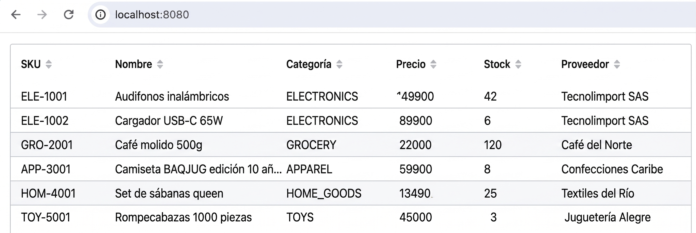
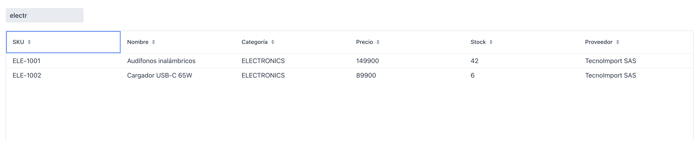

# Sesión 2  -  Grid y búsqueda reactiva con Signals

**Rama**: `sesion-2`
**Lo que vas a lograr**: una tabla real con datos de prueba, ordenable, con
un campo de búsqueda que filtra en vivo usando Signals  -  el sistema de
estado reactivo de Vaadin.

---

## Parte 1 - De campos sueltos a un Grid de verdad
Los campos sueltos de la Sesión 1 ya cumplieron su propósito: mostrarte la
mecánica básica de componentes y layouts. Ahora vamos a lo que de verdad va
a ser el corazón de esta app: un `Grid`, la tabla avanzada de Vaadin.

Reemplaza el contenido de `ProductListView` por lo siguiente:

```java
package com.baqjug.stockpilot.product;

import com.vaadin.flow.component.grid.Grid;
import com.vaadin.flow.component.orderedlayout.VerticalLayout;
import com.vaadin.flow.router.Route;

import java.math.BigDecimal;
import java.time.LocalDate;
import java.util.ArrayList;
import java.util.List;

@Route("")
public class ProductListView extends VerticalLayout {

    private final Grid<Product> grid = new Grid<>();

    public ProductListView() {
        setSizeFull();
        configureGrid();
        add(grid);
    }

    private void configureGrid() {
        grid.setSizeFull();

        grid.addColumn(Product::getSku).setHeader("SKU").setSortable(true);
        grid.addColumn(Product::getName).setHeader("Nombre").setSortable(true);
        grid.addColumn(Product::getCategory).setHeader("Categoría").setSortable(true);
        grid.addColumn(Product::getUnitPrice).setHeader("Precio").setSortable(true);
        grid.addColumn(Product::getStockQuantity).setHeader("Stock").setSortable(true);
        grid.addColumn(Product::getSupplier).setHeader("Proveedor").setSortable(true);

        grid.setItems(getSampleProducts());
    }

    private List<Product> getSampleProducts() {
        List<Product> products = new ArrayList<>();
        products.add(new Product(1L, "ELE-1001", "Audífonos inalámbricos", ProductCategory.ELECTRONICS,
                new BigDecimal("149900"), 42, 10, "TecnoImport SAS", true, LocalDate.now().minusDays(5)));
        products.add(new Product(2L, "ELE-1002", "Cargador USB-C 65W", ProductCategory.ELECTRONICS,
                new BigDecimal("89900"), 6, 15, "TecnoImport SAS", true, LocalDate.now().minusDays(40)));
        products.add(new Product(3L, "GRO-2001", "Café molido 500g", ProductCategory.GROCERY,
                new BigDecimal("22000"), 120, 30, "Café del Norte", true, LocalDate.now().minusDays(2)));
        products.add(new Product(4L, "APP-3001", "Camiseta BAQJUG edición 10 años", ProductCategory.APPAREL,
                new BigDecimal("59900"), 8, 20, "Confecciones Caribe", true, LocalDate.now().minusDays(15)));
        products.add(new Product(5L, "HOM-4001", "Set de sábanas queen", ProductCategory.HOME_GOODS,
                new BigDecimal("134900"), 25, 10, "Textiles del Río", true, LocalDate.now().minusDays(60)));
        products.add(new Product(6L, "TOY-5001", "Rompecabezas 1000 piezas", ProductCategory.TOYS,
                new BigDecimal("45000"), 3, 12, "Juguetería Alegre", true, LocalDate.now().minusDays(90)));
        return products;
    }
}
```

!!! note "Agrega el constructor completo a `Product`"
    Este código usa un constructor de `Product` con los diez campos en
    orden. Si en la Sesión 1 solo generaste el constructor vacío, agregá
    también uno con todos los parámetros (en IntelliJ: `Alt+Insert` →
    **Constructor**, selecciona todos los campos).

!!! abstract "Vaadin al paso: columnas manuales, no `Grid(Product.class)`"
    Si le pasas `Product.class` al constructor de `Grid`, genera columnas
    automáticamente por cada propiedad de la clase  -  pero en la práctica
    casi nunca es lo que quieres: te muestra el id, en el orden que Java
    decida, sin control del formato. Por eso las agregamos manualmente con
    `grid.addColumn(Product::getSku)`, una referencia al método getter. Cada
    `addColumn` devuelve un objeto `Column` que puedes seguir configurando
    con `.setHeader(...)` y `.setSortable(true)`.

Corre `mvn spring-boot:run` y confirma que la tabla se ve, ordena por
columna, y ocupa toda la pantalla (`setSizeFull()` en el grid y en la
vista).



Los datos siguen siendo un método en memoria  -  eso lo resolvemos en la
Sesión 6  -  pero ya podemos construir toda la experiencia de usuario sin
depender de una base de datos desde el día uno. Así trabaja el propio
equipo de Vaadin en sus tutoriales, y así vamos a trabajar nosotros.

---

## Parte 2 - Qué es un Signal, con el ejemplo más simple posible
Antes de aplicar Signals a la búsqueda, veamos el problema que resuelven
con el ejemplo más chico posible: un contador.

**Sin Signals**, así se escribe un contador que se actualiza a mano:

```java
public class TraditionalCounter extends VerticalLayout {
    private int count = 0;

    public TraditionalCounter() {
        Button button = new Button("Clicked 0 times");
        button.addClickListener(click -> {
            count++;
            button.setText("Clicked " + count + " times"); // actualización manual
        });
        add(button);
    }
}
```

Funciona, pero el patrón "cambiar el dato y acordarte de actualizar cada
componente que dependía de él" no escala: si tres componentes distintos
mostraran ese contador, tendrías que acordarte de actualizar los tres, cada
vez, en cada lugar donde el dato cambia.

**Con Signals**, declaras la relación una sola vez:

```java
public class SignalCounter extends VerticalLayout {
    private final ValueSignal<Integer> count = new ValueSignal<>(0);

    public SignalCounter() {
        Button button = new Button();
        button.addClickListener(click -> count.update(c -> c + 1));
        add(button);

        // Se actualiza solo cada vez que count cambia
        button.bindText(count.map(c -> "Clicked " + c + " times"));
    }
}
```

!!! abstract "Vaadin al paso: `ValueSignal`, `update`, `map` y `bindText`"
    - `ValueSignal<T>` es un contenedor de un solo valor que Vaadin observa.
      `new ValueSignal<>(0)` arranca en cero.
    - `.update(c -> c + 1)` cambia el valor a partir del valor anterior  -  el
      equivalente reactivo de `count++`.
    - `.map(fn)` transforma el valor del signal en otra cosa (acá, un
      `Integer` en un `String`), sin modificar el signal original.
    - `button.bindText(...)` enlaza el texto del botón al resultado de esa
      transformación. Cada vez que `count` cambia, el texto se actualiza
      solo  -  no escribiste ningún `button.setText(...)` manual.

No escribimos ningún código que diga "cuando cambie el contador, actualiza
el botón". Ese comportamiento surge solo, porque declaramos la relación
entre el dato y la UI, no la secuencia de pasos para mantenerla
sincronizada. Esa es la diferencia entre programación imperativa y
reactiva, y es la idea que vamos a aplicar ahora a un caso real: la
búsqueda del Grid.

---

## Parte 3 - Búsqueda reactiva aplicada al Grid
Vamos a crear un `ValueSignal<String>` que represente lo que el usuario
escribe en un campo de búsqueda, y enlazarlo directamente al campo  -  sin
escuchar un evento de cambio de valor a mano.

```java
package com.baqjug.stockpilot.product;

import com.vaadin.flow.component.grid.Grid;
import com.vaadin.flow.component.orderedlayout.VerticalLayout;
import com.vaadin.flow.component.textfield.TextField;
import com.vaadin.flow.data.value.ValueChangeMode;
import com.vaadin.flow.router.Route;
import com.vaadin.flow.signals.Signal;
import com.vaadin.flow.signals.local.ValueSignal;

import java.math.BigDecimal;
import java.time.LocalDate;
import java.util.ArrayList;
import java.util.List;
import java.util.stream.Collectors;

@Route("")
public class ProductListView extends VerticalLayout {

    private final Grid<Product> grid = new Grid<>();
    private final List<Product> products = getSampleProducts();
    private final ValueSignal<String> searchQuery = new ValueSignal<>("");

    public ProductListView() {
        setSizeFull();
        configureGrid();

        TextField searchField = new TextField();
        searchField.setPlaceholder("Buscar");
        searchField.setValueChangeMode(ValueChangeMode.LAZY);
        searchField.bindValue(searchQuery, searchQuery::set);
        add(searchField);

        add(grid);

        Signal.effect(this, () -> updateProductList(searchQuery.get()));
    }

    // configureGrid() queda igual que en la Parte 1

    private void updateProductList(String query) {
        List<Product> filtered = products;
        if (query != null && !query.isBlank()) {
            String lowerQuery = query.toLowerCase();
            filtered = products.stream()
                    .filter(p -> p.getSku().toLowerCase().contains(lowerQuery)
                            || p.getName().toLowerCase().contains(lowerQuery)
                            || p.getCategory().name().toLowerCase().contains(lowerQuery)
                            || (p.getSupplier() != null && p.getSupplier().toLowerCase().contains(lowerQuery)))
                    .collect(Collectors.toCollection(ArrayList::new));
        }
        grid.setItems(filtered);
    }

    // getSampleProducts() queda igual que en la Parte 1
}
```

!!! abstract "Vaadin al paso: `bindValue` y `Signal.effect`"
    - `searchField.bindValue(searchQuery, searchQuery::set)` crea una
      sincronización de **dos vías**: si el usuario escribe, `searchQuery`
      cambia; si cambias `searchQuery` por código, el campo se actualiza
      solo.
    - `Signal.effect(this, () -> ...)` ejecuta el bloque una vez al cargar
      la vista, y **lo vuelve a ejecutar automáticamente** cada vez que
      cambia cualquier signal leído dentro de él con `.get()`. Acá leemos
      `searchQuery.get()`, así que cada cambio de búsqueda dispara de nuevo
      el filtrado. El primer argumento, `this`, ata el efecto al ciclo de
      vida de la vista: se limpia solo si la vista se destruye.
    - `ValueChangeMode.LAZY` espera a que el usuario deje de escribir un
      instante antes de sincronizar el valor con el servidor, en vez de
      mandar cada tecla. El filtro se siente instantáneo sin saturar de
      tráfico.

Prueba escribiendo "café", "electro", o el nombre de un proveedor.



---

## Cierre de la sesión

```bash
git add .
git commit -m "sesion-2: grid con datos de prueba y búsqueda reactiva con Signals"
git branch sesion-2
```

En la [Sesión 3](sesion_3.md) llega una parte clave para cualquier proyecto
real: usar Signals para calcular KPIs de negocio, no solo para sincronizar
un campo de texto.
