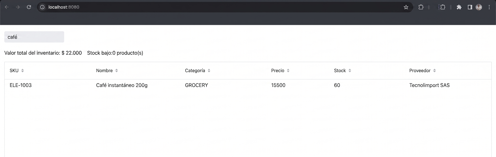

# Sesión 3: KPIs con Signals computados

**Rama**: `sesion-3`
**Lo que vas a lograr**: dos números de negocio (el valor total del
inventario y la cantidad de productos con stock bajo) que se recalculan
solos, en tiempo real, incluso cuando el usuario está filtrando. Sin un
solo listener manual.

Esta sesión es donde Signals deja de ser solo un truco de sincronización
de UI y se gana el título de "sistema de estado reactivo". Piensa en un
caso real: el área de operaciones te pide un panel donde el valor total
del inventario y la cantidad de productos con stock bajo se vean siempre
actualizados, sin que nadie tenga que refrescar la página ni apretar un
botón "Recalcular". La mayoría de los proyectos usan Signals (o cualquier
librería reactiva parecida) solo para dos cosas: sincronizar un campo de
búsqueda, y sincronizar la selección de una tabla. Nunca para calcular
algo. Acá sí, porque vamos a encadenar signals para derivar un dato de
negocio a partir de otro.

---

## Parte 1: El objetivo, antes del código
Queremos que en cualquier momento se puedan leer dos cosas, sin escribir un
solo listener manual:

1. **Cuánto vale en pesos** todo el inventario que se está mostrando ahora
   mismo.
2. **Cuántos productos** están por debajo de su nivel de reorden.

Y queremos que estos dos números se recalculen solos cuando cambian los
datos, incluso cuando el usuario está escribiendo en el buscador de la
Sesión 2. Si filtramos por "café", el valor total del inventario debería
mostrar solo el valor del café, no de todo el catálogo.

---

## Parte 2: El paso clave: que los datos visibles SEAN un Signal
Hasta ahora, `updateProductList` recibía el resultado del filtro y se lo
pasaba directo al grid con `grid.setItems(filtered)`. Para poder derivar
KPIs de esos datos, primero necesitamos que el resultado del filtro exista
como un signal, no solo como una variable de método.

```java
private final ValueSignal<List<Product>> visibleProducts = new ValueSignal<>(List.of());
```

Y cambiamos el método de filtrado para que, en vez de tocar el grid
directamente, actualice este nuevo signal:

```java
private void updateVisibleProducts(String query) {
    List<Product> filtered = products;
    if (query != null && !query.isBlank()) {
        String lowerQuery = query.toLowerCase();
        filtered = products.stream()
                .filter(p -> p.getSku().toLowerCase().contains(lowerQuery)
                        || p.getName().toLowerCase().contains(lowerQuery)
                        || p.getCategory().name().toLowerCase().contains(lowerQuery)
                        || (p.getSupplier() != null && p.getSupplier().toLowerCase().contains(lowerQuery)))
                .collect(Collectors.toCollection(ArrayList::new));
    }
    visibleProducts.set(filtered);
}
```

Y en el constructor, un segundo efecto separado, encargado únicamente de
reflejar `visibleProducts` en el grid:

```java
Signal.effect(this, () -> updateVisibleProducts(searchQuery.get()));
Signal.effect(this, () -> grid.setItems(visibleProducts.get()));
```

!!! danger "Por qué separar en dos efectos"
    Podríamos haber dejado todo en un solo efecto que filtra y llama a
    `grid.setItems(...)` de una. Lo separamos a propósito: el primer efecto
    convierte "búsqueda" en "datos visibles" (una decisión de negocio); el
    segundo refleja "datos visibles" en la UI (una decisión de
    presentación). Esta separación es la que nos permite, en la Parte 3,
    derivar los KPIs directamente de `visibleProducts` sin que le importe
    de dónde salieron esos datos: de una búsqueda, de una alta, de una
    baja, de lo que sea.

---

## Parte 3: Signals computados: `Signal.computed`
Con `visibleProducts` como signal, ya podemos declarar valores derivados de
él, sin tocarlo. A esto se le llama un **signal computado**: se define una
sola vez con `Signal.computed(...)`, y Vaadin lo recalcula automáticamente
cada vez que cambia cualquier signal leído dentro, en este caso,
`visibleProducts`.

```java
private final Signal<BigDecimal> totalInventoryValue = Signal.computed(() ->
        visibleProducts.get().stream()
                .map(p -> p.getUnitPrice().multiply(BigDecimal.valueOf(p.getStockQuantity())))
                .reduce(BigDecimal.ZERO, BigDecimal::add));

private final Signal<Long> lowStockCount = Signal.computed(() ->
        visibleProducts.get().stream().filter(Product::isLowStock).count());
```

!!! abstract "Vaadin al paso: `Signal.computed` vs `Signal.effect`"
    Los dos reaccionan a cambios, pero para cosas distintas.
    `Signal.effect` corre un efecto secundario (actualizar un componente,
    imprimir un log) y no devuelve nada útil para leer después.
    `Signal.computed` **devuelve un nuevo signal de solo lectura**, cuyo
    valor es el resultado del cálculo. Usás `effect` cuando quieres *hacer*
    algo al cambiar un dato; usás `computed` cuando quieres *derivar* un
    dato nuevo a partir de otros.

Ahora armamos la UI de estos dos números: dos "tarjetas" simples, con un
título y un valor, enlazadas con `bindText` directamente a los signals
computados.

```java
private HorizontalLayout buildKpiBar() {
    Span totalValueAmount = new Span();
    totalValueAmount.bindText(totalInventoryValue.map(this::formatCurrency));
    Div totalValueCard = kpiCard("Valor total del inventario", totalValueAmount);

    Span lowStockAmount = new Span();
    lowStockAmount.bindText(lowStockCount.map(count -> count + " producto(s)"));
    Div lowStockCard = kpiCard("Stock bajo", lowStockAmount);

    HorizontalLayout kpiBar = new HorizontalLayout(totalValueCard, lowStockCard);
    kpiBar.addClassName("kpi-bar");
    return kpiBar;
}

private Div kpiCard(String title, Span valueSpan) {
    Span titleSpan = new Span(title);
    titleSpan.addClassName("kpi-title");
    valueSpan.addClassName("kpi-value");

    Div card = new Div(titleSpan, valueSpan);
    card.addClassName("kpi-card");
    return card;
}

private String formatCurrency(BigDecimal amount) {
    NumberFormat format = NumberFormat.getCurrencyInstance(new Locale("es", "CO"));
    format.setMaximumFractionDigits(0);
    return format.format(amount);
}
```

Agrega `add(buildKpiBar());` en el constructor, justo antes de `add(grid)`.
Las clases CSS (`kpi-bar`, `kpi-card`, `kpi-title`, `kpi-value`) todavía no
tienen estilo (eso llega en la Sesión 8), así que por ahora se van a ver
como texto plano, sin tarjeta. Es un buen momento para recordar que en
Vaadin la lógica y el estilo son pasos separados: primero el dato correcto
en pantalla, después el CSS.

---

## Parte 4: El momento clave: probalo filtrando
Corre la aplicación y escribe "café" en el buscador.



!!! success "Lo que acaba de pasar"
    No escribiste ningún código que diga "cuando busques, actualiza
    también el total". Ese comportamiento surgió solo, porque
    `totalInventoryValue` depende de `visibleProducts`, y `visibleProducts`
    cambia con cada búsqueda. La cadena de dependencias (búsqueda →
    datos visibles → KPI) la armaste una sola vez, y a partir de ahí se
    mantiene sola. Este es el tipo de resultado que casi ningún tutorial
    introductorio de Signals muestra, porque casi ninguno encadena signals
    más allá de dos pasos, y es justo lo que un caso de negocio real
    necesita.

---

## Parte 5: Marcar (sin todavía colorear) el stock bajo
Para cerrar, preparamos el terreno de la Sesión 8: le decimos al Grid qué
filas son de stock bajo, aunque el color todavía no se vea.

```java
grid.setPartNameGenerator(product -> product.isLowStock() ? "low-stock-row" : null);
```

Agrega esta línea dentro de `configureGrid()`.

!!! note "¿Por qué no se ve nada distinto todavía?"
    `setPartNameGenerator` le agrega una etiqueta CSS (`low-stock-row`) a
    las celdas de esas filas, pero sin una regla de CSS que le dé color a
    esa etiqueta, no cambia nada visualmente. Es un ejemplo real de separar
    "marcar el dato" de "darle estilo": dos responsabilidades, dos
    momentos. Vas a escribir esa regla de CSS en la Sesión 8.

---

## Cierre de la sesión

```bash
git add .
git commit -m "sesion-3: KPIs de negocio con Signals computados"
git branch sesion-3
```

En la [Sesión 4](sesion_4.md) construimos el formulario de detalle,
enlazado a la selección del Grid y validado con Binder.
