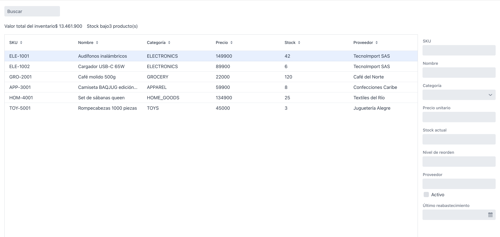
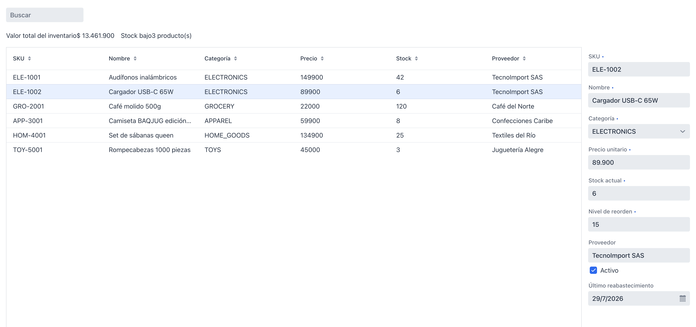

# Sesión 4  -  Formulario, Binder y validación

**Rama**: `sesion-4`
**Lo que vas a lograr**: un formulario de detalle que aparece al
seleccionar un producto en el Grid, se llena solo con sus datos, y valida
lo que el usuario escribe antes de aceptarlo.

---

## Parte 1 - El formulario, enlazado a la selección
Vamos a construir el formulario en dos pasos separados a propósito. Primero
la estructura y la visibilidad  -  con Signals, igual que en las sesiones
anteriores. Recién en la Parte 2 lo conectamos a los datos reales con
Binder. Separar los dos pasos ayuda a ver con claridad qué resuelve cada
herramienta.

Vaadin tiene un `FormLayout`, pensado específicamente para formularios: da
responsividad de fábrica y controla dónde va la etiqueta de cada campo.
Vamos a declarar un campo por cada propiedad de `Product` como variable de
instancia  -  los vamos a necesitar de nuevo en la Parte 2, cuando el Binder
tenga que referenciarlos.

```java
private final TextField skuField = new TextField("SKU");
private final TextField nameField = new TextField("Nombre");
private final ComboBox<ProductCategory> categoryField = new ComboBox<>("Categoría");
private final TextField priceField = new TextField("Precio unitario");
private final IntegerField stockField = new IntegerField("Stock actual");
private final IntegerField reorderLevelField = new IntegerField("Nivel de reorden");
private final TextField supplierField = new TextField("Proveedor");
private final Checkbox activeField = new Checkbox("Activo");
private final DatePicker lastRestockedField = new DatePicker("Último reabastecimiento");

private final FormLayout detailForm = buildDetailForm();

private FormLayout buildDetailForm() {
    FormLayout form = new FormLayout();
    form.setWidth("300px");
    form.add(skuField, nameField, categoryField, priceField, stockField,
            reorderLevelField, supplierField, activeField, lastRestockedField);
    categoryField.setItems(ProductCategory.values());
    return form;
}
```

!!! note "El precio como `TextField`, no `NumberField`"
    `NumberField` trabaja con `Double`, que no es seguro para dinero por
    errores de redondeo. Vamos a manejar el precio como `BigDecimal`, así
    que el campo es un `TextField` de texto plano, y en la Parte 2 le
    agregamos un conversor que lo traduce a `BigDecimal` con validación
    incluida.

Ahora, para saber qué producto está seleccionado, creamos otro
`ValueSignal`, esta vez de tipo `Product`, que arranca en `null`  -  nadie
seleccionado  -  y lo actualizamos cada vez que el usuario hace clic en una
fila:

```java
private final ValueSignal<Product> selectedProduct = new ValueSignal<>(null);
```

```java
grid.addSelectionListener(event ->
        selectedProduct.set(event.getFirstSelectedItem().orElse(null)));
```

Y ponemos el grid y el formulario lado a lado:

```java
HorizontalLayout content = new HorizontalLayout(grid, detailForm);
content.setSizeFull();
add(content);
```

Por último, enlazamos la visibilidad del formulario a si hay o no una
selección, con el mismo `map` que ya usamos en la Sesión 3 para transformar
un signal en otro:

```java
detailForm.bindVisible(selectedProduct.map(Objects::nonNull));
```

Corre la app, haz clic en una fila y confirma que el formulario aparece
 - vacío todavía -  y que al deseleccionar (clic de nuevo en la misma fila)
desaparece.



---

## Parte 2 - Binder: conectar el formulario a un `Product` real
El formulario aparece, pero está vacío. Para conectar sus campos a un
objeto `Product`, usamos el `Binder`  -  la pieza de Vaadin dedicada a mapear
propiedades de un bean a componentes de UI, con validación incluida.

!!! danger "Signals y Binder no compiten, resuelven cosas distintas"
    Signals maneja **qué se muestra y cuándo**  -  visibilidad, texto,
    habilitado. Binder maneja **cómo se lee y escribe un formulario** contra
    un bean, con validación. Los vamos a usar juntos: un `Signal.effect`
    decide *cuándo* releer el formulario (cada vez que cambia la
    selección); el Binder hace la lectura y escritura en sí.

```java
private final Binder<Product> binder = new Binder<>(Product.class);

private void configureBinder() {
    binder.forField(skuField)
            .asRequired("El SKU es obligatorio")
            .withValidator(sku -> sku.matches("^[A-Z]{3}-\\d{3,5}$"),
                    "El SKU debe tener el formato ABC-1234")
            .bind(Product::getSku, Product::setSku);

    binder.forField(nameField)
            .asRequired("El nombre es obligatorio")
            .bind(Product::getName, Product::setName);

    binder.forField(categoryField)
            .asRequired("Selecciona una categoría")
            .bind(Product::getCategory, Product::setCategory);

    binder.forField(priceField)
            .asRequired("El precio es obligatorio")
            .withConverter(new StringToBigDecimalConverter("Ingresa un número válido"))
            .withValidator(price -> price.compareTo(BigDecimal.ZERO) > 0,
                    "El precio debe ser mayor a cero")
            .bind(Product::getUnitPrice, Product::setUnitPrice);

    binder.forField(stockField)
            .asRequired("El stock es obligatorio")
            .withValidator(stock -> stock >= 0, "El stock no puede ser negativo")
            .bind(Product::getStockQuantity, Product::setStockQuantity);

    binder.forField(reorderLevelField)
            .asRequired("El nivel de reorden es obligatorio")
            .withValidator(level -> level >= 0, "El nivel de reorden no puede ser negativo")
            .bind(Product::getReorderLevel, Product::setReorderLevel);

    binder.forField(supplierField)
            .bind(Product::getSupplier, Product::setSupplier);

    binder.forField(activeField)
            .bind(Product::isActive, Product::setActive);

    binder.forField(lastRestockedField)
            .bind(Product::getLastRestockedDate, Product::setLastRestockedDate);
}
```

Llama a `configureBinder()` en el constructor, después de `configureGrid()`.

!!! abstract "Vaadin al paso: `forField`, `asRequired`, `withConverter`, `withValidator`, `bind`"
    - `binder.forField(campo)` arranca la configuración de un campo.
    - `.asRequired(mensaje)` lo marca obligatorio: si queda vacío, se
      muestra el mensaje y el valor no se escribe en el bean.
    - `.withConverter(...)` transforma el tipo del campo (acá, `String`) al
      tipo de la propiedad del bean (`BigDecimal`). Vaadin trae
      conversores para los casos comunes  - `StringToIntegerConverter`,
      `StringToDoubleConverter`, `StringToBigDecimalConverter` -  así no hay
      que escribirlos a mano.
    - `.withValidator(condición, mensaje)` agrega una regla propia. Se
      evalúa **después** del converter, así que opera sobre el tipo ya
      convertido  -  por eso el validador del precio recibe un `BigDecimal`,
      no un `String`.
    - `.bind(getter, setter)` conecta el campo, ya validado, a los métodos
      del bean. A partir de acá, el Binder sabe leer y escribir esa
      propiedad.

Con el Binder configurado, todavía no sabe de qué producto leer. Para eso,
un `Signal.effect` más: cada vez que cambia `selectedProduct`, releemos sus
valores en el formulario.

```java
Signal.effect(this, () -> binder.readBean(selectedProduct.get()));
```

!!! tip "`readBean(null)` limpia el formulario"
    Si no hay ningún producto seleccionado, `selectedProduct.get()` es
    `null`, y `binder.readBean(null)` deja todos los campos vacíos. No hace
    falta un `if` para ese caso  -  el propio Binder lo maneja.

Corre la app, haz clic en distintas filas y mira cómo el formulario se
llena solo. Borra el nombre de un campo y mira el borde rojo de validación;
escribe un SKU sin el formato correcto y mira el mensaje de error
específico.



---

## Cierre de la sesión

```bash
git add .
git commit -m "sesion-4: formulario de detalle con Binder y validación"
git branch sesion-4
```

En la [Sesión 5](sesion_5.md) agregamos los botones Guardar y Descartar, y
la posibilidad de crear y eliminar productos.
