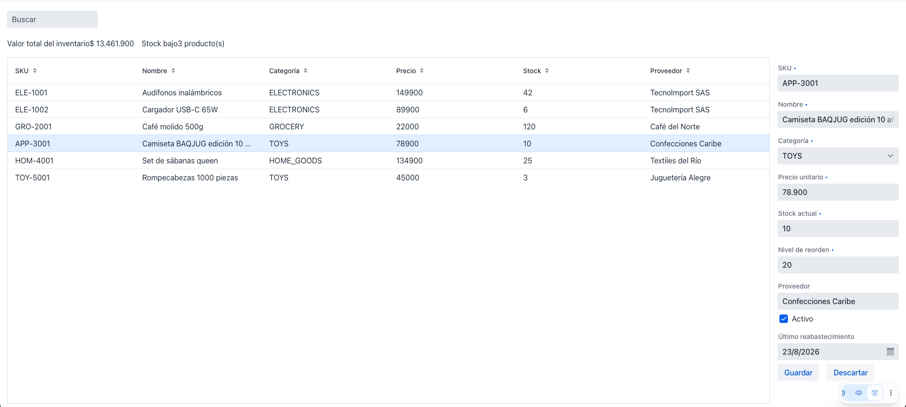
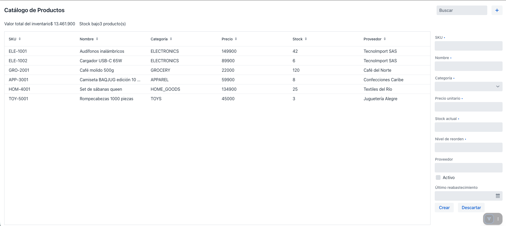
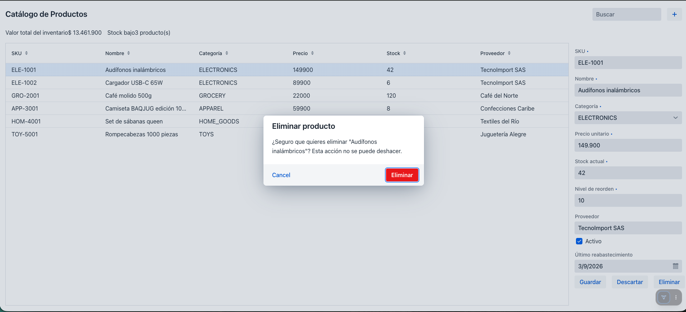

# Sesión 5  -  Guardar, descartar, alta y baja

**Rama**: `sesion-5`
**Lo que vas a lograr**: guardar y descartar cambios de forma explícita,
crear productos nuevos desde una barra de herramientas, y eliminarlos con
un diálogo de confirmación.

---

## Parte 1 - Modo buffered: guardar y descartar
Ahora mismo, como usamos `binder.readBean(...)` (no `binder.setBean(...)`),
ya estamos en lo que Vaadin llama modo **"buffered"**: los cambios que el
usuario hace en los campos no se escriben en el bean hasta que alguien lo
pida explícitamente. Si en cambio hubiéramos usado `setBean`, estaríamos en
modo **"write-through"**: cada tecla se escribiría de inmediato en el
objeto  -  lo cual casi nunca es lo que quieres en un formulario real, porque
significa que una edición a medio hacer ya está "guardada" en memoria antes
de que el usuario decida algo.

Agregamos los botones al formulario:

```java
private final Button saveButton = new Button("Guardar");
private final Button discardButton = new Button("Descartar");
```

```java
form.add(new HorizontalLayout(saveButton, discardButton));
```

**Descartar** es el más simple: volvemos a leer el bean actual, y como no
le escribimos nada, los campos regresan a su último valor guardado.

```java
discardButton.addClickListener(event -> binder.readBean(selectedProduct.peek()));
```

!!! danger "`peek()`, no `get()`, dentro de un click listener"
    `get()` registra una dependencia reactiva  -  úsalo dentro de un
    `Signal.effect` o un `Signal.computed`, donde quieres que el bloque se
    vuelva a ejecutar si el signal cambia. `peek()` lee el valor actual
    **sin** registrar esa dependencia. Dentro de un click listener no
    quieres que este código se dispare de nuevo cada vez que cambie
    `selectedProduct`  -  solo quieres su valor en el instante del clic. Por
    eso todo el código dentro de listeners de botón en esta guía usa
    `peek()`.

**Guardar** llama a `binder.writeBean(...)`, que intenta escribir todos los
campos al bean. Si algo no pasa validación, lanza una excepción y no
escribe nada  -  el propio formulario ya está mostrando los errores, así que
el `catch` puede quedar vacío.

```java
private void save() {
    Product product = selectedProduct.peek();
    if (product == null) {
        return;
    }
    try {
        binder.writeBean(product);
        updateVisibleProducts(searchQuery.peek());
        Notification.show("Producto guardado");
    } catch (ValidationException e) {
        // El formulario ya resalta los campos inválidos.
    }
}
```

```java
saveButton.addClickListener(event -> save());
```

Edita el nombre de un producto, dale Guardar, y confirma que el grid se
actualiza. Edita otro y dale Descartar: debería revertir sin guardar nada.



---

## Parte 2 - Alta de productos
Primero, una barra de herramientas de verdad: título, buscador, y un botón
de agregar, todos en una fila.

```java
private final Button addButton = new Button(new Icon(VaadinIcon.PLUS));

private HorizontalLayout buildToolbar() {
    H3 title = new H3("Catálogo de Productos");
    title.getStyle().set("flex-grow", "1");

    TextField searchField = new TextField();
    searchField.setPlaceholder("Buscar");
    searchField.setValueChangeMode(ValueChangeMode.LAZY);
    searchField.bindValue(searchQuery, searchQuery::set);

    HorizontalLayout toolbar = new HorizontalLayout(title, searchField, addButton);
    toolbar.setWidthFull();
    toolbar.setDefaultVerticalComponentAlignment(HorizontalLayout.Alignment.CENTER);
    return toolbar;
}
```

Reemplaza el `TextField` de búsqueda suelto del constructor por
`add(buildToolbar());`. El `flex-grow: 1` en el título empuja el buscador y
el botón hacia la derecha.

Para crear un producto, la lógica es simple gracias a todo lo que ya
armamos: solo hay que poner un `Product` nuevo, vacío, como el producto
seleccionado. El formulario se abre solo, porque su visibilidad ya está
enlazada a "hay alguien seleccionado" (Sesión 4), y el Binder lo va a leer,
porque también ya está enlazado a la selección.

```java
private void addProduct() {
    grid.deselectAll();
    selectedProduct.set(new Product());
}
```

```java
addButton.addClickListener(event -> addProduct());
```

!!! note "`grid.deselectAll()` antes de crear"
    Como conectamos la selección con `addSelectionListener` (una vía: grid
    → signal), poner el signal a mano no cambia lo que el grid muestra
    como seleccionado. `deselectAll()` evita que quede una fila vieja
    resaltada mientras el formulario muestra un producto nuevo.

Un producto nuevo se distingue de uno existente por una sola cosa: todavía
no tiene id.

```java
private boolean isNewProduct(Product product) {
    return product != null && product.getId() == null;
}
```

Vamos a usar esa condición para que el botón Guardar diga "Crear" en vez de
"Guardar" cuando corresponda, con el mismo patrón de `bindText` +
`map` que ya usamos para los KPIs en la Sesión 3:

```java
saveButton.bindText(selectedProduct.map(p -> isNewProduct(p) ? "Crear" : "Guardar"));
```

Cambia la declaración de `saveButton` para que no tenga texto fijo
(`new Button()`), ya que ahora lo controla el `bindText`.

Y ajusta `save()` para que, si el producto es nuevo, le asigne un id y lo
agregue a la lista en memoria:

```java
private long nextProductId = 100L;

private void save() {
    Product product = selectedProduct.peek();
    if (product == null) {
        return;
    }
    boolean wasNew = isNewProduct(product);
    try {
        binder.writeBean(product);
        if (wasNew) {
            product.setId(nextProductId++);
            products.add(product);
        }
        updateVisibleProducts(searchQuery.peek());
        Notification.show("Producto guardado");
    } catch (ValidationException e) {
        // ...
    }
}
```

!!! note "Esta asignación manual de id es temporal"
    En la Sesión 6, cuando conectemos una base de datos real, el id lo va a
    generar la base automáticamente, y esta línea (`nextProductId++`) va a
    desaparecer. Por ahora, mientras trabajamos en memoria, alguien tiene
    que hacer ese trabajo.

Haz clic en el botón **+**, llena el formulario, y guarda. El botón
debería decir "Crear" mientras el producto es nuevo.



---

## Parte 3 - Baja con diálogo de confirmación
Para borrar, lo último que queremos es que un clic accidental elimine algo
sin preguntar. Vaadin trae un componente hecho exactamente para esto:
`ConfirmDialog`.

```java
private final Button deleteButton = new Button("Eliminar");
```

Agrégalo al mismo `HorizontalLayout` de botones del formulario:

```java
form.add(new HorizontalLayout(saveButton, discardButton, deleteButton));
```

```java
private void confirmDelete() {
    Product product = selectedProduct.peek();
    if (product == null) {
        return;
    }
    ConfirmDialog dialog = new ConfirmDialog();
    dialog.setHeader("Eliminar producto");
    dialog.setText("¿Seguro que quieres eliminar \"" + product.getName() + "\"? Esta acción no se puede deshacer.");
    dialog.setCancelable(true);
    dialog.setConfirmText("Eliminar");
    dialog.setConfirmButtonTheme("error primary");
    dialog.addConfirmListener(event -> {
        products.remove(product);
        grid.deselectAll();
        selectedProduct.set(null);
        updateVisibleProducts(searchQuery.peek());
        Notification.show("Producto eliminado");
    });
    dialog.open();
}
```

```java
deleteButton.addClickListener(event -> confirmDelete());
```

!!! abstract "Vaadin al paso: `ConfirmDialog`"
    `setHeader`/`setText` arman el contenido; `setCancelable(true)` agrega
    un botón de cancelar además del de confirmar; `setConfirmText(...)`
    cambia la etiqueta del botón de confirmación; `setConfirmButtonTheme`
    le aplica variantes de tema (lo vas a ver de nuevo en la Sesión 8).
    `addConfirmListener` corre solo si el usuario efectivamente confirma  - 
    cancelar simplemente cierra el diálogo sin ejecutar nada.

Por último, no tiene sentido mostrar el botón Eliminar mientras estás
creando un producto que ni siquiera existe todavía en ningún lado. Lo
deshabilitamos reutilizando `isNewProduct`:

```java
deleteButton.bindEnabled(selectedProduct.map(p -> p != null && !isNewProduct(p)));
```

Prueba: haz clic en **+** y confirma que Eliminar aparece deshabilitado;
haz clic en una fila existente y confirma que se habilita. Elimina un
producto y verifica el diálogo.



---

## Cierre de la sesión

```bash
git add .
git commit -m "sesion-5: guardar, descartar, alta y baja con confirmación"
git branch sesion-5
```

En la [Sesión 6](sesion_6.md) reemplazamos la lista en memoria por una base
de datos real con Spring Data JPA.
