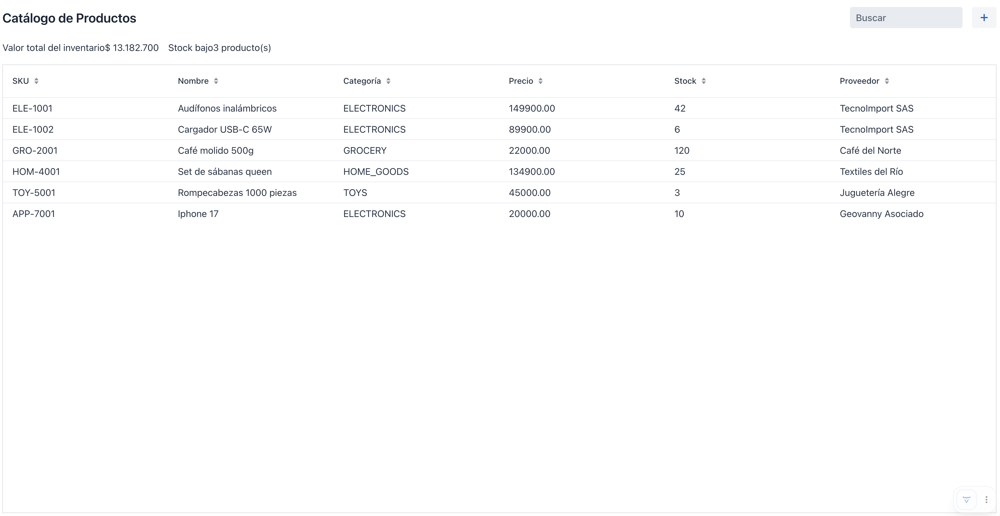

# Sesión 6: Backend real con Spring Data JPA

**Rama**: `sesion-6`
**Lo que vas a lograr**: reemplazar la lista en memoria por una base H2
real, con `ProductRepository` y `ProductService` viviendo junto a todo lo
demás de la funcionalidad "producto": la prueba concreta de por qué
package-by-feature importa.

---

## Parte 1: `Product` se convierte en una entidad JPA
Le agregamos anotaciones a `Product` **sin moverla de paquete**. Sigue
viviendo en `product/`, junto al resto de las clases de esta funcionalidad.

```java
package com.baqjug.stockpilot.product;

import jakarta.persistence.Column;
import jakarta.persistence.Entity;
import jakarta.persistence.EnumType;
import jakarta.persistence.Enumerated;
import jakarta.persistence.GeneratedValue;
import jakarta.persistence.GenerationType;
import jakarta.persistence.Id;
import jakarta.persistence.Table;

@Entity
@Table(name = "product")
public class Product {

    @Id
    @GeneratedValue(strategy = GenerationType.IDENTITY)
    private Long id;

    @Column(nullable = false, unique = true)
    private String sku;

    @Column(nullable = false)
    private String name;

    @Enumerated(EnumType.STRING)
    private ProductCategory category;

    @Column(nullable = false)
    private BigDecimal unitPrice;

    // el resto de los campos, sin cambios
}
```

!!! abstract "Spring al paso: las anotaciones de persistencia"
    - `@Entity` marca la clase como una tabla administrada por JPA/Hibernate.
    - `@Table(name = "product")` fija el nombre de la tabla explícitamente.
    - `@Id` señala la llave primaria; `@GeneratedValue(strategy =
      GenerationType.IDENTITY)` delega la generación del id a la base de
      datos (un autoincremental).
    - `@Column(nullable = false, unique = true)` describe restricciones de
      la columna: acá, que el SKU no puede repetirse.
    - `@Enumerated(EnumType.STRING)` guarda el enum como texto
      (`"ELECTRONICS"`) en vez de como un número de posición, que se
      rompería si algún día reordenás los valores del enum.

!!! danger "Lo importante: la clase no cambió de lugar"
    Esta es la comprobación de la decisión que tomamos en la Sesión 1: la
    entidad, el repositorio y el servicio que estás por crear van a vivir
    en el mismo paquete `product/` que la vista. No hay que saltar a un
    paquete `backend` para tocar la persistencia.

Agrega a `pom.xml` las dependencias que todavía no tenías (si generaste el
proyecto sin ellas en la Sesión 1):

```xml
<dependency>
    <groupId>org.springframework.boot</groupId>
    <artifactId>spring-boot-starter-data-jpa</artifactId>
</dependency>
<dependency>
    <groupId>com.h2database</groupId>
    <artifactId>h2</artifactId>
    <scope>runtime</scope>
</dependency>
```

Y en `application.properties`:

```properties
spring.datasource.url=jdbc:h2:mem:stockpilot
spring.jpa.hibernate.ddl-auto=create-drop
```

---

## Parte 2: Repositorio y servicio, en el mismo paquete
`product/ProductRepository.java`:

```java
package com.baqjug.stockpilot.product;

import org.springframework.data.jpa.repository.JpaRepository;

public interface ProductRepository extends JpaRepository<Product, Long> {
}
```

!!! abstract "Spring al paso: `JpaRepository`"
    Extender `JpaRepository<Product, Long>` te regala `save`, `findAll`,
    `findById`, `delete` y más, sin escribir una sola implementación. El
    segundo parámetro de tipo (`Long`) es el tipo del id.

`product/ProductService.java`:

```java
package com.baqjug.stockpilot.product;

import org.springframework.stereotype.Service;
import java.util.List;

@Service
public class ProductService {

    private final ProductRepository repository;

    public ProductService(ProductRepository repository) {
        this.repository = repository;
    }

    public List<Product> findAll() {
        return repository.findAll();
    }

    public Product save(Product product) {
        return repository.save(product);
    }

    public void delete(Product product) {
        repository.delete(product);
    }

    public long count() {
        return repository.count();
    }
}
```

!!! tip "La vista nunca toca el repositorio directamente"
    `ProductListView` va a depender de `ProductService`, nunca de
    `ProductRepository`. Es una regla simple que evita que la lógica de
    negocio (por poca que sea acá) se disperse entre la vista y el acceso
    a datos.

---

## Parte 3: Sembrar datos sin `data.sql`
Podríamos poblar la base con un `data.sql` de toda la vida, pero eso trae
un riesgo concreto: si escribes los IDs a mano en el `INSERT`, pueden
desincronizarse con el autoincremental de la base (`GenerationType.IDENTITY`),
y el primer alta real desde la UI puede chocar contra un id que "ya estaba
usado". En vez de eso, sembramos reutilizando el mismo `ProductService.save()`
que usa el resto de la aplicación.

`product/ProductDataSeeder.java`:

```java
package com.baqjug.stockpilot.product;

import org.springframework.boot.ApplicationArguments;
import org.springframework.boot.ApplicationRunner;
import org.springframework.stereotype.Component;
import java.math.BigDecimal;
import java.time.LocalDate;

@Component
public class ProductDataSeeder implements ApplicationRunner {

    private final ProductService productService;

    public ProductDataSeeder(ProductService productService) {
        this.productService = productService;
    }

    @Override
    public void run(ApplicationArguments args) {
        if (productService.count() > 0) {
            return;
        }
        productService.save(sample("ELE-1001", "Audífonos inalámbricos", ProductCategory.ELECTRONICS,
                "149900", 42, 10, "TecnoImport SAS", 5));
        // ... el resto de los productos de muestra de la Sesión 2
    }

    private Product sample(String sku, String name, ProductCategory category, String price,
                            int stock, int reorderLevel, String supplier, int restockedDaysAgo) {
        Product product = new Product();
        product.setSku(sku);
        product.setName(name);
        product.setCategory(category);
        product.setUnitPrice(new BigDecimal(price));
        product.setStockQuantity(stock);
        product.setReorderLevel(reorderLevel);
        product.setSupplier(supplier);
        product.setActive(true);
        product.setLastRestockedDate(LocalDate.now().minusDays(restockedDaysAgo));
        return product;
    }
}
```

!!! abstract "Spring al paso: `ApplicationRunner`"
    Cualquier bean que implemente `ApplicationRunner` corre su método
    `run(...)` una vez, justo después de que la aplicación termina de
    arrancar. Es el lugar correcto para sembrar datos de arranque sin
    escribir SQL a mano.

---

## Parte 4: Conectar la vista al servicio real
Inyectamos `ProductService` en el constructor de la vista: inyección de
dependencias normal de Spring, sin anotaciones especiales, porque Vaadin ya
registra las vistas como beans de Spring por nosotros.

```java
private final ProductService productService;

public ProductListView(ProductService productService) {
    this.productService = productService;
    // ... el resto del constructor sin cambios
}
```

Reemplaza la lista en memoria por llamadas al servicio en los tres lugares
donde antes usábamos `products`:

```java
private void updateVisibleProducts(String query) {
    List<Product> all = productService.findAll();
    List<Product> filtered = all;
    if (query != null && !query.isBlank()) {
        // el filtro queda igual, ahora sobre "all" en vez de "products"
    }
    visibleProducts.set(filtered);
}
```

```java
// en save():
productService.save(product);   // reemplaza el nextProductId++ / products.add(product)

// en confirmDelete():
productService.delete(product); // reemplaza products.remove(product)
```

Puedes borrar el método `getSampleProducts()` y el campo `products`, ya no
se usan.

Reinicia el servidor por completo (esto sí necesita reinicio, no hot
reload, porque cambiamos el datasource) y confirma que la tabla carga desde la
base real.



---

## Cierre de la sesión

```bash
git add .
git commit -m "sesion-6: backend real con Spring Data JPA"
git branch sesion-6
```

En la [Sesión 7](sesion_7.md) agregamos navegación entre pantallas, y una
segunda funcionalidad que demuestra en la práctica por qué package-by-feature
escala.
