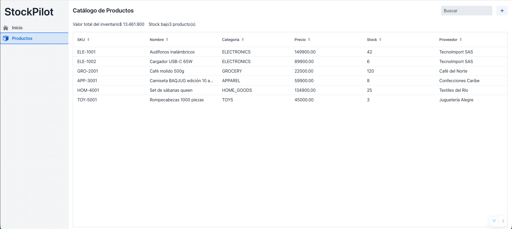

# Sesión 7: Navegación y una segunda feature

**Rama**: `sesion-7`
**Lo que vas a lograr**: un menú de navegación entre dos pantallas, y la
comprobación práctica de la promesa de package-by-feature: agregar una
funcionalidad nueva sin tocar la que ya existe.

---

## Parte 1: El App Shell
Hasta ahora solo tenemos una vista, así que no hace falta navegación. Antes
de agregar la segunda, armamos la cáscara de la aplicación: un layout
compartido con un menú lateral.

Esto **sí** es transversal a toda la app: no es "de producto" ni de
ninguna otra funcionalidad de negocio, así que va en el paquete técnico
que reservamos desde la Sesión 1: `shell/`.

`shell/MainLayout.java`:

```java
package com.baqjug.stockpilot.shell;

import com.baqjug.stockpilot.dashboard.DashboardView;
import com.baqjug.stockpilot.product.ProductListView;
import com.vaadin.flow.component.applayout.AppLayout;
import com.vaadin.flow.component.html.H1;
import com.vaadin.flow.component.icon.VaadinIcon;
import com.vaadin.flow.component.orderedlayout.HorizontalLayout;
import com.vaadin.flow.component.sidenav.SideNav;
import com.vaadin.flow.component.sidenav.SideNavItem;
import com.vaadin.flow.router.Layout;

@Layout
public class MainLayout extends AppLayout {

    public MainLayout() {
        setPrimarySection(Section.DRAWER);

        H1 appName = new H1("StockPilot");
        appName.addClassName("app-name");

        HorizontalLayout header = new HorizontalLayout(appName);
        header.setPadding(true);
        addToDrawer(header);

        SideNav nav = new SideNav();
        nav.addItem(new SideNavItem("Inicio", DashboardView.class, VaadinIcon.HOME.create()));
        nav.addItem(new SideNavItem("Productos", ProductListView.class, VaadinIcon.PACKAGE.create()));
        addToDrawer(nav);
    }
}
```

!!! abstract "Vaadin al paso: `@Layout`, `AppLayout` y `SideNav`"
    - `AppLayout` es el componente base para una cáscara de aplicación con
      cabecera y/o menú lateral (`drawer`).
    - `@Layout` le dice a Vaadin que aplique esta cáscara a **todas** las
      vistas automáticamente, sin que cada vista tenga que declararlo.
    - `setPrimarySection(Section.DRAWER)` pone el menú a la izquierda en
      vez de arriba.
    - `SideNavItem("Inicio", DashboardView.class, icono)` crea un ítem de
      menú que navega a la vista indicada por su clase, sin que tengas que
      escribir la URL a mano.

Este archivo va a fallar en compilar hasta que exista `DashboardView`,
que es justo lo que armamos ahora.

---

## Parte 2: La segunda feature: `dashboard/`
Vamos a crear un paquete completamente nuevo, `dashboard/`, con una vista
de inicio que resume el estado del inventario. Presta atención a esta
regla mientras la escribes: **esta vista SÍ puede depender de
`ProductService`** (la API pública de la feature de producto) **pero
jamás de `ProductRepository`**. Una feature puede consumir la API pública
de otra; nunca meterse en sus entrañas.

`dashboard/DashboardView.java`:

```java
package com.baqjug.stockpilot.dashboard;

import com.baqjug.stockpilot.product.Product;
import com.baqjug.stockpilot.product.ProductService;
import com.vaadin.flow.component.html.Div;
import com.vaadin.flow.component.html.H2;
import com.vaadin.flow.component.html.Span;
import com.vaadin.flow.component.orderedlayout.HorizontalLayout;
import com.vaadin.flow.component.orderedlayout.VerticalLayout;
import com.vaadin.flow.router.Route;

import java.math.BigDecimal;
import java.text.NumberFormat;
import java.util.List;
import java.util.Locale;

@Route("")
public class DashboardView extends VerticalLayout {

    public DashboardView(ProductService productService) {
        setSizeFull();
        add(new H2("Bienvenido a StockPilot"));

        List<Product> products = productService.findAll();
        BigDecimal totalValue = products.stream()
                .map(p -> p.getUnitPrice().multiply(BigDecimal.valueOf(p.getStockQuantity())))
                .reduce(BigDecimal.ZERO, BigDecimal::add);
        long lowStock = products.stream().filter(Product::isLowStock).count();

        Div totalCard = kpiCard("Valor total del inventario", formatCurrency(totalValue));
        Div countCard = kpiCard("Productos en catálogo", String.valueOf(products.size()));
        Div lowStockCard = kpiCard("Stock bajo", lowStock + " producto(s)");

        HorizontalLayout kpis = new HorizontalLayout(totalCard, countCard, lowStockCard);
        kpis.addClassName("kpi-bar");
        add(kpis);
    }

    private Div kpiCard(String title, String value) {
        Span titleSpan = new Span(title);
        titleSpan.addClassName("kpi-title");
        Span valueSpan = new Span(value);
        valueSpan.addClassName("kpi-value");
        Div card = new Div(titleSpan, valueSpan);
        card.addClassName("kpi-card");
        return card;
    }

    private String formatCurrency(BigDecimal amount) {
        NumberFormat format = NumberFormat.getCurrencyInstance(new Locale("es", "CO"));
        format.setMaximumFractionDigits(0);
        return format.format(amount);
    }
}
```

Nota que esta vista calcula sus KPIs con un cálculo directo, no con
Signals: es una pantalla de "una sola lectura al entrar", sin
interacción en vivo, así que no necesita reactividad. Signals se justifica
cuando el dato cambia mientras el usuario mira la pantalla (como en la
Sesión 3); acá no es el caso.

Por último, movemos `ProductListView` de la raíz a su propia ruta, porque
la raíz ahora es del dashboard:

```java
@Route("products")   // antes era @Route("")
public class ProductListView extends VerticalLayout {
```

---

## Parte 3: Comprobar que package-by-feature cumplió su promesa
Corre la aplicación y navega entre "Inicio" y "Productos" con el menú
lateral.



!!! success "Lo que acabas de comprobar"
    Agregaste una funcionalidad completa (una vista nueva, cálculos
    propios, una entrada de menú) sin modificar ni una sola línea dentro
    de `product/`. Todo lo nuevo vive en `dashboard/`. Esa es exactamente
    la promesa que hicimos en la Sesión 1: package-by-feature no es una
    preferencia estética, es la razón por la que esto fue una carpeta
    nueva y no una cirugía sobre el código existente.

---

## Cierre de la sesión

```bash
git add .
git commit -m "sesion-7: navegación con App Shell y segunda feature (dashboard)"
git branch sesion-7
```

En la [Sesión 8](sesion_8.md), la última, le damos a StockPilot un tema
propio.
