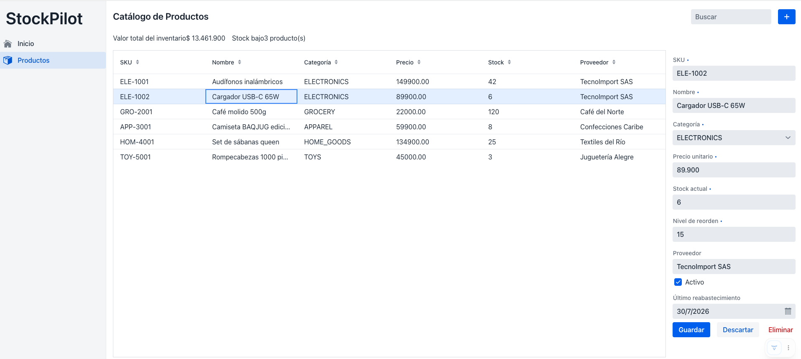
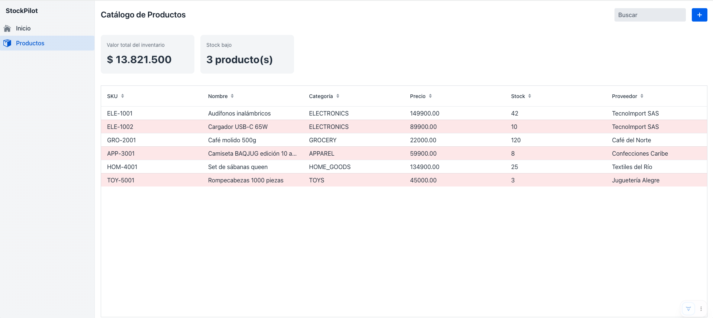
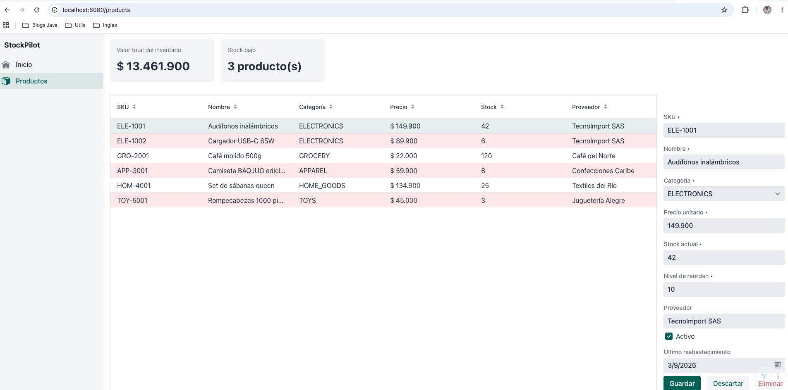

# Sesión 8  -  Theming, CSS y marca propia

**Rama**: `sesion-8` (= `main`)
**Lo que vas a lograr**: que StockPilot se vea como un producto, no como
una demo  -  variantes de tema listas para usar, CSS propio para lo que las
variantes no cubren, y (opcional) tu propia paleta de marca.

---

## Parte 1 - Variantes de tema: estilo sin escribir CSS
Lo más rápido para darle personalidad a la UI son las **variantes de
tema**: estilos predefinidos que ya vienen con cada componente.

```java
saveButton.addThemeVariants(ButtonVariant.LUMO_PRIMARY);
deleteButton.addThemeVariants(ButtonVariant.LUMO_ERROR, ButtonVariant.LUMO_TERTIARY);
addButton.addThemeVariants(ButtonVariant.LUMO_PRIMARY);
```

Y en el diálogo de confirmación de la Sesión 5, la variante se pasa como
texto:

```java
dialog.setConfirmButtonTheme("error primary");
```

!!! abstract "Vaadin al paso: variantes de tema"
    Cada familia de componentes (`Button`, `TextField`, `Grid`...) trae un
    set de variantes propio, accesible como constantes de un enum
    (`ButtonVariant`, en este caso). `LUMO_PRIMARY` rellena el fondo del
    botón con el color principal del tema; `LUMO_ERROR` lo pinta de rojo;
    `LUMO_TERTIARY` le saca el borde. Puedes combinar varias a la vez, como
    en el botón Eliminar. Antes de escribir CSS a mano para algo, revisa si
    ya existe una variante  -  la documentación de cada componente en
    vaadin.com/docs las lista todas.

Corre la app: Guardar debería verse en azul sólido, Eliminar en rojo.



---

## Parte 2 - CSS propio, para lo que las variantes no cubren
Para el resto  -  las tarjetas de KPI de las Sesiones 3 y 7, y el color de
las filas de stock bajo que marcamos en la Sesión 3  -  escribimos CSS de
verdad.

Primero, le decimos a Vaadin que cargue un tema propio. Crea
`AppShell.java` en el paquete `shell/`:

```java
package com.baqjug.stockpilot.shell;

import com.vaadin.flow.component.page.AppShellConfigurator;
import com.vaadin.flow.theme.Theme;

@Theme("stockpilot")
public class AppShell implements AppShellConfigurator {
}
```

!!! abstract "Vaadin al paso: `@Theme` y `AppShellConfigurator`"
    `AppShellConfigurator` es una interfaz "marcador": cualquier clase que
    la implemente puede configurar aspectos globales de la aplicación que
    no pertenecen a ninguna vista en particular (el `<head>` del HTML, el
    tema, metadatos). `@Theme("stockpilot")` le dice a Vaadin que busque y
    cargue `frontend/themes/stockpilot/styles.css` como hoja de estilos
    global, por encima de los estilos base de Lumo.

Crea el archivo `frontend/themes/stockpilot/styles.css`:

```css
.app-name {
    font-weight: bold;
    font-size: 1.1rem;
}

.kpi-bar {
    gap: var(--lumo-space-m);
    padding: var(--lumo-space-m) 0;
    flex-wrap: wrap;
}

.kpi-card {
    background-color: var(--lumo-contrast-5pct);
    border-radius: var(--lumo-border-radius-l);
    padding: var(--lumo-space-m);
    display: flex;
    flex-direction: column;
    gap: var(--lumo-space-xs);
    min-width: 220px;
}

.kpi-title {
    font-size: var(--lumo-font-size-s);
    color: var(--lumo-secondary-text-color);
}

.kpi-value {
    font-size: var(--lumo-font-size-xxl);
    font-weight: bold;
}

/* Filas de stock bajo -- la etiqueta la generó grid.setPartNameGenerator
   en la Sesión 3, acá recién le damos color. */
vaadin-grid::part(low-stock-row) {
    background-color: var(--lumo-error-color-10pct);
}
```

!!! tip "Las variables `--lumo-*`"
    Lumo, el tema base de Vaadin, define sus colores, espaciados y
    tipografías como variables CSS (`--lumo-primary-color`,
    `--lumo-space-m`, etc.). Usarlas en tu propio CSS, en vez de valores
    fijos, hace que tus estilos respeten automáticamente el modo claro/oscuro
    y cualquier ajuste de marca que hagas más adelante.

Reinicia el servidor (los cambios de tema a veces no aplican con hot
reload) y confirma que las filas de stock bajo aparecen en rojo suave, y
que las tarjetas de KPI ya tienen forma de tarjeta.



Un último detalle, opcional pero prolijo: un poco de espacio arriba del
formulario de detalle:

```java
detailForm.getStyle().set("padding-top", "30px");
```

!!! abstract "Vaadin al paso: `getStyle()`"
    Todo componente tiene un método `getStyle()` que devuelve un objeto
    para aplicar propiedades CSS puntuales desde Java, sin necesidad de una
    clase CSS aparte. Es útil para ajustes de un solo componente; para
    estilos reutilizables entre varios, una clase CSS (como `kpi-card`)
    sigue siendo mejor.

---

## Parte 3 - Tu propia paleta de marca (opcional)

Vaadin tiene un generador de temas donde puedes armar visualmente tu propia
paleta y exportar el CSS resultante. Elige una paleta, exporta el CSS, y
pégalo debajo del bloque de estilos propios en `styles.css`. No hace falta
tocar ni una línea de Java para esto  -  es la ventaja de que el theming esté
completamente separado de la lógica.



---

## Cierre: StockPilot completo

Con esto, StockPilot tiene Grid con búsqueda reactiva, KPIs computados,
formulario validado, alta y baja, base de datos real, navegación entre dos
funcionalidades, y un tema propio  -  todo en Java, todo organizado por
funcionalidad de negocio.

```bash
git add .
git commit -m "sesion-8: theming, CSS y marca propia"
git branch sesion-8
git branch -f main sesion-8
```

Mira las [Referencias](referencias.md) para seguir profundizando.
